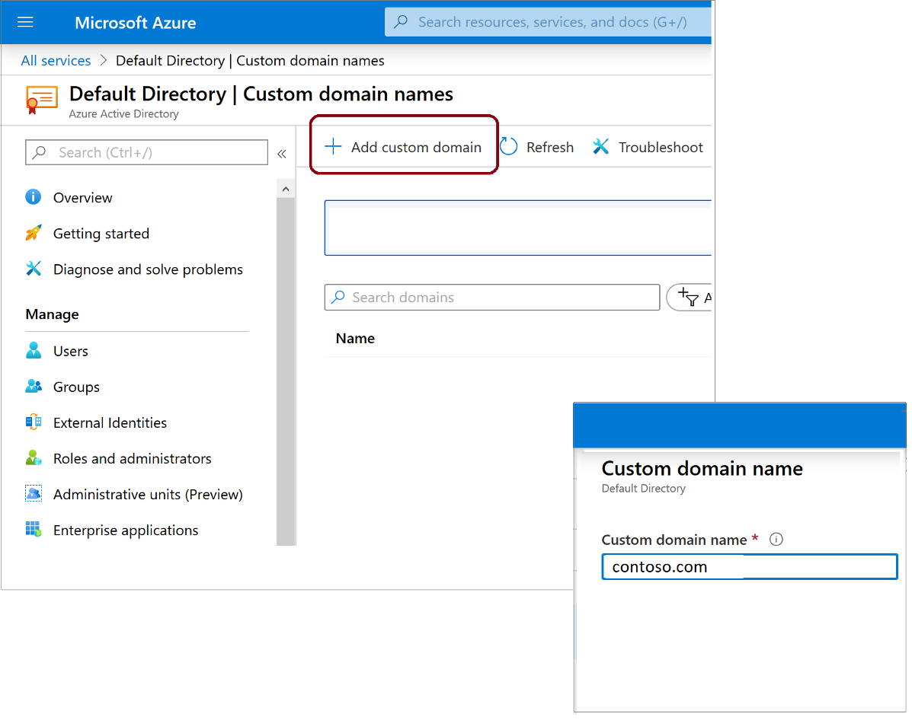

**The chapter below is still work in progress!**

# 1.2 - Azure Active Directory

Azure starts with Azure Active Directory (which we often call AzureAD or use the acronym AAD). There is no other way. Even if you want to use a third-party identity management solution like Okta, you will still need to use Azure AD in between. So you have no option - you must get to know it well. 

## What is Azure Active Directory

AzureAD is a Software-as-a-Service (SaaS) enterprise Identity and Access Management (IAM) solution. It is a cloud-based and multitenant service that offers:
- authentication - it verifies users' identities and issues access tokens,
- authorisation - it verifies users' access permissions to Enterprise Applications, which can be published via AAD.

Today Azure AD offers a wide range of advanced security, collaboration, and other features besides the core identity and access capabilities. We will only explore some of them, as their scope is big enough to make it into a separate course. 

The name of the service is, however, misleading. While we cannot use Azure without Azure AD, AAD is not a part of Azure, and many customers use it without ever thinking of deploying any Azure Resources. Azure Active Directory is also the backbone of other cloud-based services offered by Microsoft, like Microsoft 365 and Dynamics 365. 

Therefore, I will often say, "Azure AD is not Azure". While it sounds controversial, it's a good rule of thumb for someone still finding their bearings in this domain. As we dive into various topics, you will understand better why I dare to say so. 

### Azure AD Glossary

Azure Active Directory introduces a fair bit of new terminology, and it is fundamental to understand what is what. We often use synonyms when referring to the same thing, so become familiar with the essential glossary below.

- **Tenant** - An essential word in our dictionary is the tenant. The tenant (often also called directory or domain) is a dedicated instance of Azure AD. Most commonly, it is intended for use by a specific organisation, but organisations can create additional tenants. As you probably remember from the previous chapter, all subscriptions belong to a single tenant - it is a tree-like structure. Therefore, creating several directories can make your governance very complex. One reasonable exception is separating end-user services like Microsoft 365 and infrastructure-focused Azure into different tenants. Due to the architecture of Azure AD (more on this very soon), such a setup can help with the separation of duties, especially when parts of IT are outsourced. A new ADD tenant was created for you when you signed up for the Azure Free account.
- **Identity** - An Identity is an entity that can be authenticated, for example, a user or an application.
- **Account** - An identity that has data associated with it.
- **Azure AD account** - An identity created through Azure AD or another Microsoft cloud service, such as Microsoft 365. Identities are stored in Azure AD and accessible to your organisation's cloud service subscriptions. This account is also sometimes called a Work or school account.

### Domains and Custom Domains

Every Azure AD tenant has a domain name used to identify the instance of the Azure Active Directory. The initial (mandatory) domain name follows the format:

> \<something of your choice\>.onmicrosoft.com

The domain name must be globally unique because ADD is a multitenant SaaS offering.

The built-in domain name will always be there with you, but you can also add a custom domain name to make your Accounts' User Principal Names (UPNs) more user-friendly.

The process of configuring a custom domain name is relatively simple and quick. It includes the following steps:
- Register a publicly-resolvable domain with a registrar of your choice
- Add the custom name in Azure AD (you will need Global Administrator permissions)
- Create the verification records in your domain's lookup zone (Azure will ask you to create a specific TXT or MX record to verify ownership of the custom name)
- Wait for the DNS change to propagate and complete the process

### Azure AD Editions

In its default form, Azure AD is a free service. However, the free edition has limited benefits and features, so you will want to upgrade to Azure AD Premium in most production scenarios. To understand why, we will look at the following table, which provides an overview of the differences between various Azure AD editions:

| Feature | Azure AD Free - Security defaults (enabled for all users) | Azure AD Free - Global Administrators only | Office 365 | Azure AD Premium P1 | Azure AD Premium P2 |
|---------|----------------------------------------------------------|--------------------------------------------|------------|---------------------|---------------------|
| Protect Azure AD tenant admin accounts with MFA | ● | ● (Azure AD Global Administrator accounts only) | ● | ● | ● |
| Mobile app as a second factor | ● | ● | ● | ● | ● |
| Phone call as a second factor |  | ● | ● | ● | ● |
| SMS as a second factor |  | ● | ● | ● | ● |
| Admin control over verification methods |  | ● | ● | ● | ● |
| Fraud alert |  |  |  | ● | ● |
| MFA Reports |  |  |  | ● | ● |
| Custom greetings for phone calls |  |  |  | ● | ● |
| Custom caller ID for phone calls |  |  |  | ● | ● |
| Trusted IPs |  |  |  | ● | ● |
| Remember MFA for trusted devices	| 	| ●	| ●	| ●	| ● |
| MFA for on-premises applications	| 	|	|	| ●	| ● |
| Conditional access	| 	|	|	| ●	| ● |
| Risk-based conditional access	| 	|	|	|	| ● |
| Identity Protection (Risky sign-ins, risky users)	| 	|	|	|	| ● |
| Access Reviews	| 	|	|	|	| ● |
| Entitlements Management	| 	|	|	|	| ● |
| Privileged Identity Management (PIM), just-in-time access	| 	|	|	|	| ● |
| Lifecycle Workflows (preview)	| 	|	|	|	| ● |

### Azure AD vs. AD

While Azure Active Directory (AAD) takes its name from Windows Server Active Directory (WS AD), it is fundamentally a different service. The key differences are shown in the following table:

| Characteristic | Azure AD | WS AD |
| -------------- | -------- | ----- |
| Structure | Flat - no Organisational Units (OUs) or Groups Policy Objects (GPOs) | Tree-like, with OUs and GPOs |
| Queried using | REST API over HTTP | LDAP |
| Authentication protocol(s) | SAML, WS-Fed, OpenID Connect, OAuth | Kerberos |
| Single Sign-On | Native | Requires AD FS |

Like with WS AD, users' devices can authenticate to Azure AD. However, the situation is slightly more complex, as we have several models available:

- Azure AD-registered devices
    - Intended for the BYOD (Bring Your Own Device) scenarios
    - Users sign in to their devices with local accounts
    - An Azure AD account (work/school) grants access to resources
    - Limited cloud security feature support
    - Supports Windows 10+, iOS, Android and MacOS

- Azure AD-joined devices
    - Intended for cloud-first or cloud-only organizations (implemented only with organization-owned devices)
    - Users can only sign in to their devices with Azure AD accounts (work/school)
    - Rich cloud security feature support
    - Supports Windows 10+ and Windows Server 2019+ (in Azure)

- Hybrid Azure-AD joined devices
    - Intended for hybrid organizations with existing on-premises AD infrastructure
    - Users can only sign in to their devices with organisational accounts 
    - Limited cloud security feature support
    - Supports Group Policy for management
    - Supports Windows 8.1+ and Windows Server 2008+

## Azure AD Users and Groups

As you might expect from an IAM (Identity and Access Management) tool, user and group management is the bread and butter of Azure AD. While you won't find any rocket science here, there are a few things to remember, so we'll look at those now.

### Users

In Azure AD, we have three types of users:
- Cloud Identities - created directly in Azure AD either via the portal GUI or programatically as part of a scripted job
- Synchronised Identities - created in Azure by AD Connect - the WS AD synchronisation tool which we will cover in the next chapter
- Guest Users - created in other Azure AD tenants and invited to your tenant (more on that later in this chapter)

*Pro Tip - when you delete a user in Azure AD, it is only soft-deleted and stays in the "bin" for 30 days. This feature allows you to recover an account deleted by mistake quickly. I've come to appreciate this feature more than I'd like*

### Exercise 1.2.1

Until now, you've been logged into Azure with the default administrator account - every Azure tenant gets one upon creation. It is a generic account that anyone within your organisation could potentially use. To follow good security practices, we shouldn't use it; instead, we should use dedicated and named accounts. We will sort that out a bit later. For now, we will implement another security recommendation.

It is not only theoretically possible to find yourself in a situation where everyone with administrative permissions in the Azure platform is either unavailable or unable to access it. That is why we always create emergency "break-glass" accounts that can be used in times of turbulence. That will be our next step.

1. If you're not logged into the Azure Portal, please do so. 
    - Be sure to use the new Microsoft Account you created while signing up for Azure.
2. Find Azure Active Directory in the Portal Menu and navigate to the Users section. Take your time to explore.

*Important - You will probably notice that the user account, created by default, looks somewhat strange. It is an external account, even though it is marked as a Member account rather than a Guest. Typically, only Guest Accounts have the #EXT# part in their UPN. It is a unique situation caused by the fact that your brand-new Microsoft account was used to give you access to the Azure AD tenant.* 

3. Create two new accounts in your AAD tenant.
    - Use names that are easy to recognise, like emergency1 and emergency2.
    - Once created, be sure to rotate the default passwords Azure generated upon creation. Use VERY strong passwords. The maximum length is now 256 characters, but 128 should be enough.

### Groups

When it comes to Groups, in Azure AD, we have two options:
- **Security** is used to manage user and computer access to shared resources. Members can include users, devices, other groups, and service principals. Owners can consist of users and service principals.

- **Microsoft 365** provides collaboration opportunities by giving group members access to a shared mailbox, calendar, files, SharePoint sites, and more. It lets you provide people outside of your organization access to the group. Members can only include users. Owners can consist of users and service principals. 

But next to that, we have several assignment options:
- **Static** - in which you manually (or statically) assign group membership.
- **Dynamic** - in which the platform automatically assigns group membership for users or devices based on their attributes.

*Important - a dynamically assigned group can include only user objects or only devices, never both.* 

### Exercise 1.2.2

We have some users, so let's add a group.

1. Go back to the Azure Portal
2. Navigate to the Groups section in the Azure AD blade.
3. Create a new group
    - I recommend the name "Azure Administrators" or something similar
    - Make it a statically assigned security group
4. Add the built-in admin account as a member

## Administrative Units

I previously mentioned that Azure AD has a flat hierarchy and does not support Organisational Units like Windows Server Active Directory. There is, however, a feature that attempts to give us a fraction of what OUs did in WS AD - Administrative Units, also referred to as AUs.

AUs can be used to group  Users, Groups, and Devices to delegate administrative tasks. That is both a lot and not enough at the same time - AUs cannot be nested (Azure AD is still flat) and support only certain permissions sets for administrators. Many permissions can only be scoped to the entire tenant.

*Important  - You will need an Azure AD P1 license for every AU administrator. AU members can have a free license.*

## Application Service Identities

If you have experience working in a Windows Server environment, the concept of a service account shouldn't feel foreign. Working with applications that relied on Active Directory, we would create a regular domain user. Then, instead of giving it a human name, we would follow the naming convention for a service account and run a service in the context of that security principal. This way, we could permit that service to access file shares, databases, and other resources.

In Azure, we use different mechanisms. We will look at them in the following sections.

### Service Principals

The first option is to use Service Principals (SPNs), which you can find in the Azure portal under App Registrations. An APN is an Azure AD identity that an application can use (can be external) to authenticate to Azure resources. The authentication can use a secret (password) or a certificate.

In the simplest scenario, once you've imported the correct library into your source code, you need to pass the SPN ObjectId and the secret value to the application, and it can authenticate against Azure AD.

### Managed Identities

Service Principals work well and are pretty easy to use, but they come with a significant drawback - they leave you with the responsibility of generating, securing, and managing credentials. In a growing environment, that task can become an impactful burden. But, thankfully, Managed Identities come to the rescue.

A Managed Identity is an Azure AD Service Principal managed by Azure. This short sentence you just read can take a few moments to sink in, but is of great importance. As you hopefully remember, Azure AD is not Azure, and Managed Identities are one of the few places where they blend.

A Managed Identity can be associated with an Azure Resource and used by that resource to access a target that supports Azure AD authentication and Azure RBAC. For example, we can assign it to a Function App and give it permission to a Storage Account. However, we never touch its credentials throughout this process and the remainder of the identity's lifecycle. Those are generated and periodically rotated by Azure.

Managed Identities come in two flavours, and both have their use cases. The table below provides a comprehensive overview:

| Property | System-assigned managed identity | User-assigned managed identity |
| --- | --- | --- |
| Creation | Created as part of an Azure resource | Created as a stand-alone Azure resource |
| Life cycle | Shared life cycle with the Azure resource | Independent life cycle Must be explicitly deleted |
| Sharing across Azure resources | Cannot be shared Can only be associated with a single Azure resource | Can be shared Can be associated with more than one Azure resource |
| Common use cases | Workloads that are contained within a single Azure resource For example, an application that runs on a single virtual machine | Workloads that run on multiple resources and which can share a single identity Workloads that need pre-authorization to a secure resource as part of a provisioning flow. Workloads where resources are recycled frequently, but permissions should stay consistent. |

## Multi-Domain Setup

Microsoft will (almost) always recommend having only a single Azure AD tenant. They have good reasons to provide such recommendations, and in many cases, I agree that it's the best option. But there are situations in which you might need to use several AAD domains.

Those special situations include the following:
- As part of a regulatory compliance framework, you need to separate the tenant of your production environment from any non-production environments
- You work for a globally distributed enterprise, and data residency laws require storing data within a specific geographical region. 
- You plan on outsourcing parts of your IT landscape to a 3rd party and want to retain a clear separation of duties. Remember - Azure AD has a flat structure, and some permissions can only be granted on the scope of the entire directory. AUs help with some things but often aren't enough.
- You work for a managed service provider and must use a separate tenant for each customer.

I exclude a sandbox tenant you might use individually or in a shared setup with a limited group to learn and try new features and services. That is an extra one for the considerations above.

*Important - If you choose or are forced to use a multi-tenant setup, I strongly recommend keeping the number of directories to the minimum and paying particular attention to securing each one with adequate measures. Each of those tenants is a liability!*

### Azure AD Business-to-Business Collaboration

When you end up having multiple tenants, you could keep them completely isolated and create duplicate user accounts (and potentially groups) in every one of them, but that would be impractical. Also, you would eventually face configuration drift and potentially expose security vulnerabilities.

You can use the Azure AD Business to Business (Azure AD B2B) collaboration to mitigate this challenge. The service allows us to invite an Azure AD account from one tenant as a guest user in another tenant. If you remember Guest Users from earlier in this chapter, that was Azure AD B2B.
When you invite an external account into your tenant, your directory only stores a reference (pointer) to the Azure AD account in another tenant. When the user tries to authenticate, they are redirected to their home tenant, and once they obtain an authentication token, they are redirected back and authorised.

As a result, you can use a single Azure AD account to access multiple Azure AD tenants. 

This service also works great when you want to give users from partner organisations access (like vendors and service providers) to a part of your Azure environment. Instead of creating (and managing) Azure AD accounts for them, you can invite them and let them use their existing identities. 

### Azure AD Busines to Customer

Azure also offers a Business to Customer service (Azure AD B2C), but the name can be misleading. You might expect similar behavior after learning about B2B, but that is untrue. To use Azure AD B2C, you create a new, particular type of Azure AD tenant. That tenant is used solely to manage end-customer identities and their access to your applications. 

Azure AD B2C offers a wide range of handy features that allow you to:
- integrate with external user stores,
- provide single sign-on access with a user-provided identity,
- create a custom-branded identity solution,
- use policies to configure user journeys,
- use progressive profiling to collect user information gradually,
- pass user data to a 3rd party for validation.

### Exercise 1.2.3

Until now, you've been working with your Azure environment using the default administrator account, and we already established that it is not a good practice. I also promised that we would fix that issue soon, and the time is now.

1. Version A - If you have an Azure AD work or school account that you use daily, invite your user to the tenant oy created for learning purposes
1. Version B - If you don't have an existing work or school account, create a new named user in your new tenant.
2. Add the new user to the "Azure Administrators" group, which you created in exercise 1.2.2

## Azure AD RBAC

In the previous chapter, we explained how Role-Based Access control works for Azure, but we never mentioned anything about Azure AD. Since ADD is a separate service, it has its own RBAC stack.

### How it works

Thankfully, Azure AD RBAC works almost the same as with Azure. The main difference lies in the depth of a structure - Azure can have an elaborate management hierarchy with several levels as possible scopes of assignments, and Azure AD is flat. We assign Azure AD RBAC roles to the scope of the entire tenant (and sometimes AUs).

### Role Definitions

Because Azure AD is used for all cloud-based services offered my Microsoft, not just Azure, it has a long list of built-in role definitions. Most of those will probably never need, but some are worth taking a closer look at:

1. Global Administrator, can:
    - Manage access to all administrative features in Azure Active Directory, as well as services that federate to Azure Active Directory
    - Assign administrator roles to others
    - Reset the password for any user and all other administrators

2. User Administrator, can:
    - Create and manage all aspects of users and groups
    - Manage support tickets
    - Monitor service health
    - Change passwords for users, Helpdesk administrators, and other User Administrators

3. Billing Administrator, can:
    - Make purchases
    - Manage subscriptions
    - Manage support tickets
    - Monitor service health

Apart from those three, I highly recommend that you check out GlobalReader, Groups Administrator, Application Administrator, and Security Administrator in the [official docs from Microsoft](https://learn.microsoft.com/en-us/azure/active-directory/roles/permissions-reference)

*IMPORTANT - Global Administrator is the highest permission level in Azure AD. The role allows you to do anything - it's the equivalent of root.

### Exercise 1.2.4

To-Do - grant global admin permissions

### Where Azure AD RBAC meets Azure RBAC

The Global Administrator role is another one of the few places Azure AD and Azure come together. If you have this Azure AD role, you can navigate to the Properties section of the Azure AD blade in the Azure Portal and use the option "Access management for Azure resources". Doing this will give you the User Access Administrator RBAC role in Azure RBAC (on the entire hierarchy). With that, you could create an assignment giving yourself the Owner permissions on any part of the Azure landscape.

**Therefore, the Global Administrator role gives you not only unrestricted access to Azure AD but also effectively to the entire Azure hierarchy within the tenant.** 

### Exercise 1.2.5

To-do - use access management for the new account

## Azure AD Security

### Identity Protection

### Conditional Access

+ trusted IPs

### Multi-Factor Authentication

### Access Reviews

## Privileged Identity Management

[<- 1.1 Azure Governance](azureGovernance.md) | [1.3 - Hybrid Identity ->](hybridIdentity.md)