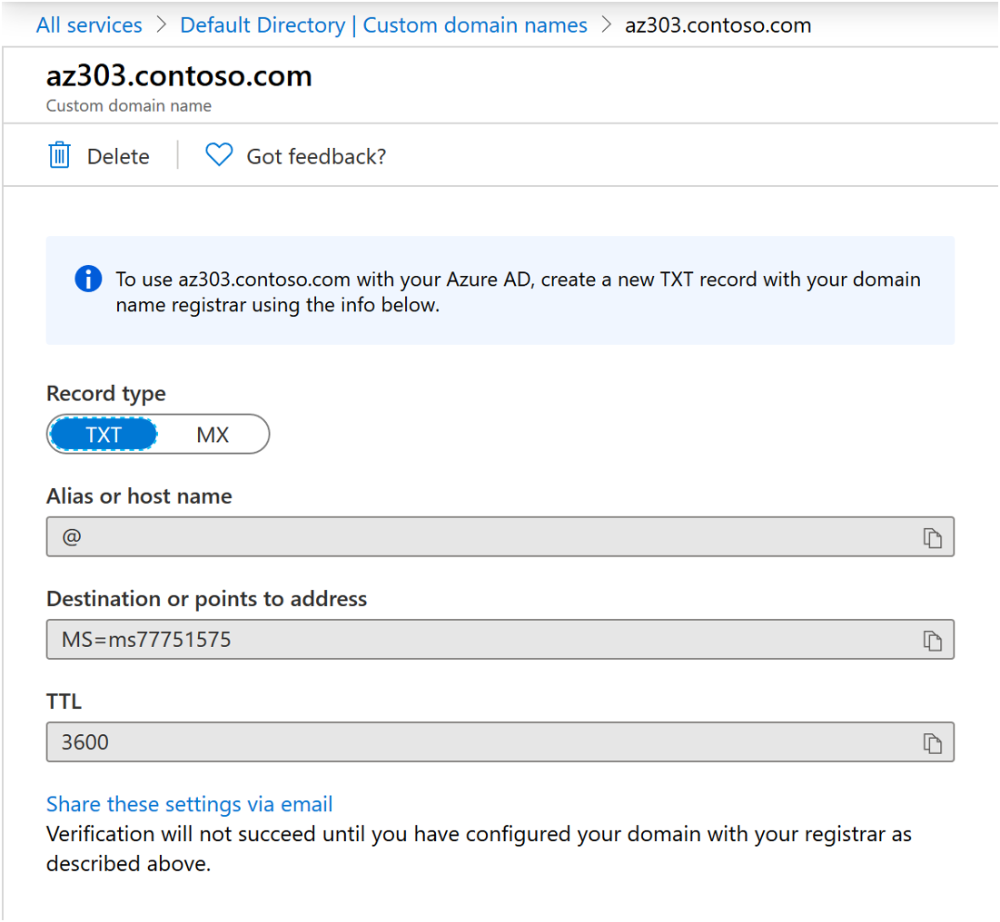

# 1.2 - Azure Active Directory

Azure starts with Azure Active Directory (which we often call AzureAD or simply use the acronym AAD), there is no other way. Even if you want to use a third-party identity management solution like Okta, you will still need to use AzureAD in between. So you have no option - you must get to know it well. 

## What is Azure Active Directory

AAD is a Software-as-a-Service (SaaS) enterprise identity management solution. It is a cloud-based and multitenant service that offers authentication and authorisation capabilities complemented by a wide range of advanced security, collaboration, and other features. 

The name of the service is, however, misleading. While we cannot use Azure without Azure AD, AAD is not a part of Azure, and many customers use it without ever thinking of deploying any Azure Resources. Azure Active Directory is also the backbone of other cloud-based services offered by Microsoft, like Microsoft 365 and Dynamics 365. 

### Azure AD Glossary

Azure Active Directory introduces a fair bit of new terminology, and it is fundamental to understand what is what. We often use synonyms when referring to the same thing, so become familiar with the essential glossary below.

- **Tenant** - The most important word in our dictionary is the tenant. The tenant (often also called directory or domain) is a dedicated instance of Azure AD, most commonly intended for use by a specific organisation. Any organsiation can create additional tenants, but as you hopefully remember from the previous chapter, all subscriptions must belong to a single tenant - it is a tree-like structure. Therefore, creating several directories can make your governance very complex. One reasonable exception is separating end-user services like Microsoft 365 and infrastructure-focused Azure into different tenants. Due to the architecture of Azure AD (more on this very soon), such a setup can help with the separation of duties, especially when parts of IT are outsourced. A new ADD tenant was created for you when you signed up for the Azure Free account.
- **Identity** - An Identity is an entity that can be authenticated, for example, a user or an application.
- **Account** - An identity that has data associated with it.
- **Azure AD account** - An identity created through Azure AD or another Microsoft cloud service, such as Microsoft 365. Identities are stored in Azure AD and accessible to your organization's cloud service subscriptions. This account is also sometimes called a Work or school account.

### Domains and Custom Domains

Every Azure AD tenant has a domain name used to identify the instance of the Azure Active Directory. The initial (mandatory) domain name follows the format:

> \<something of your choice\>.onmicrosoft.com

So, as you might have already guessed, given that ADD is a multi-tenant SaaS offering, the domain name must be globally unique.

The built-in domain name will always be there with you, but you can also add a custom domain name to make your Accounts' User Principal Names (UPNs) more user-friendly.

The process of configuring a custom domain name is relatively simple and quick. It includes the following steps:
- Register a publicly-resolvable domain with a registrar of your choice
- Add the custom name in Azure AD (you will need Global Administrator permissions)
- Create the verification records in your domain's lookup zone (Azure will ask you to create a specific TXT or MX record to verify ownership of the custom name)
- Wait for the DNS change to propagate and complete the process

### Azure AD Editions

In its default form, Azure AD is a free service. However, the free edition has limited benefits and features, so you will want to upgrade to Azure AD Premium in most production scenarios. 

The following table provides an overview of the differences between various Azure AD editions.

### Azure AD vs. AD

While Azure Active Directory (AAD) takes its name from Windows Server Active Directory (WS AD), it is fundamentally a different service. The key differences are shown in the following table:

| Characteristic | Azure AD | WS AD |
| -------------- | -------- | ----- |
| Structure | Flat - no Organisational Units (OUs) or Groups Policy Objects (GPOs) | Tree-like, with OUs and GPOs |
| Queried using | REST API over HTTP | LDAP |
| Authentication protocol(s) | SAML, WS-Fed, OpenID Connect, OAuth | Kerberos |
| Single Sign-On | Native | Requires AD FS |

Like with WS AD, users' devices can authenticate to Azure AD. However, the situation is slightly more complex, as we have several models available:

- Azure AD-registered devices
    - Intended for the BYOD (Bring Your Own Device) scenarios
    - Users sign in to their devices with local accounts
    - An Azure AD account (work/school) grants access to resources
    - Limited cloud security feature support
    - Supports Windows 10+, iOS, Android and MacOS

- Azure AD-joined devices
    - Intended for cloud-first or cloud-only organizations (implemented only with organization-owned devices)
    - Users can only sign in to their devices with Azure AD accounts (work/school)
    - Rich cloud security feature support
    - Supports Windows 10+ and Windows Server 2019+ (in Azure)

- Hybrid Azure-AD joined devices
    - Intended for hybrid organizations with existing on-premises AD infrastructure
    - Users can only sign in to their devices with organisational accounts 
    - Limited cloud security feature support
    - Supports Group Policy for management
    - Supports Windows 8.1+ and Windows Server 2008+

## Azure AD Users and Groups

As you might expect from an IAM (Identity and Access Management) tool, user and group management is the bread and butter of Azure AD. While you won't find any rocket science here, there are a few things to remember, so we'll look at those now.

### Users

In Azure AD, we have three types of users:
- Cloud Identities - created directly in Azure AD either via the portal GUI or programatically as part of a scripted job
- Synchronised Identities - created in Azure by AD Connect - the WS AD synchronisation tool which we will cover in the next chapter
- Guest Users - created in other Azure AD tenants and invited to your tenant (more on that later in this chapter)

*Pro Tip - when you delete a user in Azure AD, it is only soft-deleted and stays in the "bin" for 30 days. This feature allows you to recover an account deleted by mistake quickly. I've come to appreciate this feature more than I'd like*

### Exercise 1.2.1

Until now, you've been logged into Azure with the default administrator account - every Azure tenant gets one upon creation. It is a generic account that anyone within your organisation could potentially use. To follow good security practices, we shouldn't use it; instead, we should use dedicated and named accounts. We will sort that out a bit later. For now, we will implement another security recommendation.

It is not only theoretically possible to find yourself in a situation where everyone with administrative permissions in the Azure platform is either unavailable or unable to access it. That is why we always create emergency "break-glass" accounts that can be used in times of turbulence. That will be our next step.

1. If you're not logged into the Azure Portal, please do so. 
    - Be sure to use the new Microsoft Account you created while signing up for Azure.
2. Find Azure Active Directory in the Portal Menu and navigate to the Users section. Take your time to explore.

*Important - You will probably notice that the user account, created by default, looks somewhat strange. It is an external account, even though it is marked as a Member account rather than a Guest. Typically, only Guest Accounts have the #EXT# part in their UPN. It is a unique situation caused by the fact that your brand-new Microsoft account was used to give you access to the Azure AD tenant.* 

3. Create two new accounts in your AAD tenant.
    - Use names that are easy to recognise, like emergency1 and emergency2.
    - Once created, be sure to rotate the default passwords Azure generated upon creation. Use VERY strong passwords. The maximum length is now 256 characters, but 128 should be enough.

### Groups

When it comes to Groups, in Azure AD, we have two options:
- **Security** is used to manage user and computer access to shared resources. Members can include users, devices, other groups, and service principals. Owners can consist of users and service principals.

- **Microsoft 365** provides collaboration opportunities by giving group members access to a shared mailbox, calendar, files, SharePoint sites, and more. It lets you provide people outside of your organization access to the group. Members can only include users. Owners can consist of users and service principals. 

But next to that, we have several assignment options:
- **Static** - in which you manually (or statically) assign group membership.
- **Dynamic** - in which the platform automatically assigns group membership for users or devices based on their attributes.

*Important - a dynamically assigned group can include only user objects or only devices, never both.* 

### Exercise 1.2.2

We have some users, so let's add a group.

1. Go back to the Azure Portal
2. Navigate to the Groups section in the Azure AD blade.
3. Create a new group
    - I recommend the name "Azure Administrators" or something similar
    - Make it a statically assigned security group
4. Add the built-in admin account and the two break-glass accounts as members

## Administrative Units

I previously mentioned that Azure AD has a flat hierarchy and does not support Organisational Units like Windows Server Active Directory. There is, however, a feature that attempts to give us a fraction of what OUs did in WS AD - Administrative Units, also referred to as AUs.

AUs can be used to group  Users, Groups, and Devices to delegate administrative tasks. That is both a lot and not enough at the same time - AUs cannot be nested (Azure AD is still flat) and support only certain permissions sets for administrators. Many permissions can only be scoped to the entire tenant.

*Important  - You will need and Azure AD P1 license for every AU administrator. AU members can have a free license.*

## Application Service Identities

### Service Principals

### Managed Identities

## Multi-Domain Setup

## Azure AD Security

### Roles and RBAC

### Identity Protection

### Conditional Access

+ trusted IPs

### Multi-Factor Authentication

### Access Reviews

## Privileged Identity Management

[<- 1.1 Azure Governance](azureGovernance.md) | [1.3 - Hybrid Identity ->](hybridIdentity.md)