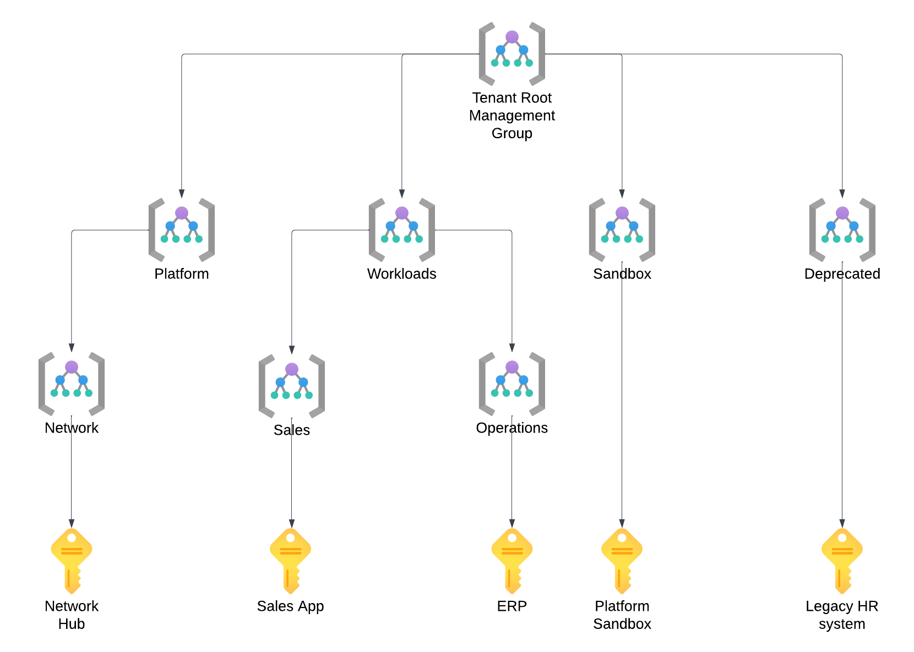

# 1.1 - Azure Governance

## What is Azure

According to Microsoft:

*"The Azure cloud platform is more than 200 products and services designed to help you bring new solutions to life—to solve today’s challenges and create the future. Build, run, and manage applications across multiple clouds, on-premises, and at the edge, with the tools and frameworks of your choice."*

But in plain English, I would say Azure is the public cloud offering from Microsoft that provides a wide range of IaaS (Infrastructure-as-a-Service) and PaaS (Platform-as-a-Service) services, which allow you to run almost any application or IT workload. 

## Buying Azure

I promised we would learn by doing, so let's start by getting yourself some Azure. The table below describes the options we have to procure Azure Subscriptions.

| Acronym | Model | Setup | Discounts |
|---------|-------|-------|-----------|
| - | Free | Complimentaty account | 200$ USD credits for 30 days + limited free access for 12 months |
| PAYG | Pay-As-You-Go | Sign-up online with a Credit Card | None, publicly availabile list prices apply |
| CSP | Cloud Solutions Privider | Buy via a Microsoft Partner | Negotiated with the CSP partner, typicvally limited |
| EA | Enterprise Account | Buy directly from Microsoft | Negotiated with Mictosoft and based on the total value of the commitment, can be significant |

There are also specific programs and incentives for educational use. For example, the Student subscription gives 100 USD for 12 months.

While we always buy the same Azure, no matter how we purchase, specific options and possibilities will vary based on the channel you use to purchase your Azure Subscriptions. For example, the workflow for creating new Subscriptions works differently - with EA, you can easily deploy them using Infra-as-Code templates; in CSP, that is not a feasible option.

### Exercise 1.1.1

Let's put that new knowledge to use and set up the Azure environment you will use for learning. 

By default, we will use the Free tier for our learning purposes. The credits you get from Microsoft should be sufficient
to complete all exercises, and the 30-day limit should provide a motivating sense of urgency. You might use the Azure Pass in a classroom setting, but I will keep assuming that we process with the free offering in the instructions.

I strongly recommend creating a brand new Microsoft account for whichever option we use, Free Account or Azure Pass. You might already have one, and it might even be eligible for the free tier. However, we will be configuring tenant-level policies in some exercises, and you could lock yourself out. To stay safe, I advise having a dedicated account for learning. 

1. Use a private browser window - we want to ensure you don't sign up with an existing Microsoft or a Work/School account.
2. Go to the [Azure website](https://azure.microsoft.com/)
3. Select "Start for Free" and then "Start Free."
4. On the Sign In page, you'll find a small print "No account? Create one!"
5. Use the option to create a new account, and in the following step, choose "Get a new email address."
6. Select an alias, set a password, and complete the process of getting a free Azure Subscription.
7. Once the process completes, you should be redirected to the Azure Portal.
8. Go to Subscriptions to verify whether your Azure Pass was redeemed successfully. If you see a subscription, you're good to start your labs!

## How is Azure structured

There are three dimensions to Azure:
- availability - general public cloud vs. sovereign clouds,
- geographical location,
- logical structure, aka the Management Hierarchy.

Let's explore each of those dimensions in detail.

### Availability

What most of us use (probably without realising) is the public version of Microsoft's public cloud called "Azure Cloud". Now you might wonder, if there is a public version of the public cloud, are there private ones as well? To answer your question - no, but there are three sovereign clouds:
- Azure Government (US Gov and US DoD)
- Azure Germany (operated by T-Systems under license from Microsoft)
- Azure China (served by 21Viatel under license from Microsoft)

All four clouds are entirely separate, with different management APIs and identity services used to grant access. 

### Geographical Locations

#### Regions
An Azure Region is the primary unit of consideration when discussing geographical location. A region represents a collection of data center facilities and ensures data residency. 
There are 60+ Azure regions across all (habitable) continents, and new ones are added regularly. 

The region(s) you choose to run your application(s) will have a significant impact down the line:

- The latency of the network connection between the end users of the applications and the region will, in most cases, dictate the performance and, thus, the experience.
- Therefore, you should aim to deploy your Resouces to a Region as close to the end users as possible. With a geographically distributed user base, you might choose a multi-region approach.
- You might be subject to regulatory requirements dictating where your and your users' data can be stored and processed.
- Some services and features are only available in select regions. 
- Prices can vary between regions located close to each other.
- Regions have different capacity pools available, so scaling out could be impacted. 

#### Geographies

While it might not be evident initially, all Regions are grouped into Geographies. Geography (often called Geo) represents a discrete market to preserve data residency and compliance boundaries.

Most geographies have two regions designated as a Region Pair, but a few exceptions exist. In most cases, however, the two locations will be separated by hundreds of kilometers, thus allowing customers to configure Disaster Recovery and retain business continuity in a regional disaster.

Also, please remember that certain regions are restricted to support specific customer scenarios, such as in-country disaster recovery. These regions are available only upon request by creating a new support request.

You can find detailed info on regional pairs [in the official Microsoft docs.](https://learn.microsoft.com/en-us/azure/reliability/cross-region-replication-azure#azure-cross-region-replication-pairings-for-all-geographies)

By design, at least one Region with a Geo will Support Availability Zones.

#### Availability Zones

Availability Zones represent separate data centre facilities within the same region. What is crucial is that they:
- are located tens of kilometers apart,
- are connected by dedicated high-throughput and low-latency fibre-optic networks,
- have independent power, cooling, and networking.

Thus Availability Zones protect against local outages within a specific region.

Some Azure services are zone-redundant by default, some can be configured to span multiple Availability Zones, and others can be zonal - deployed to a specific zone. 

**The configuration of zone redundancy will be an essential aspect of your architectural considerations and a fundamental component of highly-available applications.**

#### Final picture

Considering Geographies, Regions, and Availability Zones, we see that we can achieve very high levels of resiliency. With a zone-redundant topology in the primary region and presence in a paired region, we can protect our application(s) from a wide variety of outages. But bear in mind that such solutions come at a cost - not only resource price but also the cost of significantly increased complexity. 

### The Logical Structure

#### The Management Hierarchy

In the management hierarchy of Azure, we have five main levels:
- Azure Active Directory – The non-optional authentication provider for Azure. This SaaS service is the root of every Azure deployment. It stores security principals like user accounts and groups and offers authentication and authrosiation capabilities. We will dive deeper into Azure AD very soon. 
- Management Group – The optional logical container used to manage multiple subscriptions together. We commonly use it to group subscriptions used by a given business unit, hosting a specific workload or managed by a unique team.
- Subscription – The primary unit of purchasing Azure.
- Resource Group – The non-optional logical container for Azure Resources. Resource groups should bring together resources that share the same lifecycle. 
- Resource - the service or component which we want to use. Every resource must be deployed to a specific Azure Region and a Resource Group.

Management Groups, Subscriptions, and Resource Groups all allow for the following:
- granting RBAC permissions (access rights flow down the hierarchy in a waterfall way)
- assigning policies
- scoping costs

We will dive deeper into all three concepts later in this course If this doesn't make complete sense just yet, give me a bit more time to put it into context.
#### Considerations for Management Groups

- Are not enabled by default - you need to opt-in to get this functionality.
- When you enable Management Groups, the platform will create the Tenant Root Group for you. The id of this group cannot be changed and is always the same as the id of your Azure AD tenant (I will explain those very soon).
- You can create a tree-like structure of Management Groups up to six levels deep (seven with the root).
- But Microsoft recommends keeping the hierarchy as flat as possible
- Consider groupings by location, environment, and business unit.
- Having two specific Management Groups - Sandbox and Decommissioned- is standard practice. The names should be relatively self-explanatory. 

#### Considerations for Subscriptions

- The Subscription is the primary unit of purchasing and governance in Azure (like an AWS account or a GCP Project)
- You need at least one and can use only one subscription, but I recommend following the recent trend of subscription democratisation - use at least one subscription per application/workload and, ideally, several to isolate DTAP environments
- I recommend a one-to-many relationship between teams and subscriptions and strongly advise against many-to-one/many relationships. In the latter scenario, teams will get into each other's way. 
- Services and features (called Resource Providers) are enabled per subscription. You can use this granularity to control which resources can be deployed in various subscriptions.
- Subscriptions have quotas that limit the number of resources of a given type that can be created in a given subscription. Some of those limits are soft and can be quickly increased via a support request, but others are hard and will force you to add additional subscriptions. You can find details info on this topic in the [official Microsoft documentation](https://learn.microsoft.com/en-us/azure/azure-resource-manager/management/azure-subscription-service-limits).

#### Considerations for Resource Groups

- Resource Groups are logical containers for Azure Resources.
- While they are only virtual entities without a physical representation, each must be deployed to a specific Azure Region. The specified location will be where the metadata is stored, so keep it in mind for regulatory compliance.
- Every Resource needs to be in a Resource Group. This is the way.
- Every Resource also must be deployed to an Azure Region, but this region does not to be the same as the region of the Resource Group. You can deploy the Resource Group to West Europe (to keep the metadata with the EU) and deploy child Resources to East US (because that's where your users are located). However, I prefer to align the Resource Groups and child Resources locations. I will soon show you why.
- Most importantly - **Resource Groups should hold together Resources that share the lifecycle.** That is, they are created, updated, and destroyed together. For example, if you have an application consisting of a web front end and a relational database, both components belong in different Resource Groups. You will probably update the front end much more often and might even choose to replace it with something completely new. But your database will likely remain as is or see only minor schema updates. 

### Exercise 1.1.2

While optional, Management Groups are a fantastic tool for controlling your growing cloud environment. The Azure Free tier only provides a single Azure Subscription, but that shouldn't stop us from learning how Management Groups work.

1. If you're not logged into the Azure Portal, please do so. 
    - Be sure to use the new Microsoft Account you created while signing up for Azure.
2. Enable Management Groups in your environment
    - Go to Management Groups in the Azure Portal and start using them
    - Pick any id/name for your first group.
3. Move Your Azure Subscription to the new Management Group
## Naming and Tagging

Naming and Tagging play a crucial role in the governance of any cloud environment, and Azure is no Exception. While there is no single way of approaching both topics, it is imperative to include them in your design considerations and implement your designs consistently. 

### Naming
As one of the industry's legends quickly reminds us, creating a good naming convention is among the most challenging tasks an IT professional must tackle. At the same time, as experience teaches us, it doesn't matter how it looks; what matters most is that you have one and stick to it. 
Therefore, I recommend you resist spending several weeks inventing the perfect naming convention. Instead, make sure that it does the following:
- allows the users to quickly and easily identify the resources they are looking for,
- complies with the requirements set by the platform regarding uniqueness and character limits,
- provides room and flexibility for exceptions,
- supports automation mechanisms (for example, by using consistent delimiters).

### Tagging

Tags provide metadata for your Azure Resources. They are key-value pairs of your choice that allow for enriching resources with valuable information. This information logically organises your resources for billing, automation, or anything else you want to achieve. 

You can find yourself in a situation where a well-designed Management Hierarchy and a solid Naming Convention leave little need for tagging, and that's OK. Use tags when needed to make your life easier, but I recommend avoiding duplicating information - the DRY principle works here as it does in software engineering. 

My favourite examples of how to use tags focus on automation:
- Scaling, both vertical (changing the SKU) and horizontal (starting/stopping instances), based on the demand or time/date.
- Deploying updates in batches.
- Configuring backup strategies. 

## Azure RBAC

Finally, we must discuss assigning permissions to complete the topic of governance. In Azure, we use Role-Based Access Control (RBAC) to define access rights. It provides fine-grained access management of resources in Azure​, thus allowing you to segregate duties within the organisation.

### How RBAC works

Let's first describe how you implement RBAC, and then I'll explain what the different terms mean:

>You create an *assignment* of a *role definition* to a *security principal* at a particular *scope*.

In simpler words, we define who, what, and where. 

- Scope - a boundary for the level of access that is required. As I mentioned, anything from the Management Groups, through Subscriptions and Resource Groups down to individual resources, can be a scope of an RBAC assignment.
- Security Principal - An object representing an entity requesting access to resources. If that sounds vague, please hold on to your questions as we will dive deeper into this topic in the next chapter.
- Role Definition - Collection of permissions that lists the operations that can be performed. 
- Assignment - the process of attaching a role definition at a selected scope. 

### Role Definitions

The Azure platform comes with a very long and ever-growing list of RBAC role definitions, but you can also create custom ones if none of the built-in options meet your needs.

*IMPORTANT - Be very cautious about creating custom RBAC roles. They remain your responsibility and require periodic reviews.*

In the long list of role definitions, there are three fundamental ones:
- Reader - Allows reading all information about Azure Resources.
- Contributor - Allows reading, creating, managing, and deleting Azure Resources.
- Owner - Extents the Contributor role by granting rights to set permissions on Azure Resources.
- User Access Administrator - Lets you manage user access to Azure resources, but not the resources themselves, a bit like Owner - Contributor.

These three generic roles include all types of resources, but there are also resource-specific roles, for example Network Contributor, which should be rather self-explanatory. 

Every Role Definition indicates which actions are allowed or not for a chosen Resouce Provider (for now, think resource type, we will dive deeper into the topic later).

*IMPORTANT - "Actions" and "NotActions" apply to the management plane, that is, the configuration of Azure resources. "DataActions" apply to the data plane, representing data stored within the resources, such as BLOBs stored in a Storage Account. Be careful when you only want to grant access to the management plane and not the data plane, or the other way around*

You can find the complete list of built-in Azure RBAC Role Definitions in the [official documentation from Microsoft](https://learn.microsoft.com/en-us/azure/role-based-access-control/built-in-roles).

### Assignments

Most RBAC assignments (called "Role Assignments") are intended to allow a security principal to perform a set of actions over the selected scope. 

You can easily check the status of RBAC by navigating to the "Access Control (IAM)" section of a chosen scope in the Azure Portal. You will find the same interface on all levels of the management hierarchy.

Azure also supports "Deny Assignments," which attach a set of deny actions to a security principal at a particular scope to deny access.

You do, however, need to keep a few critical facts in mind:
-  Deny assignments are currently read-only and are set by Azure Blueprints and Azure Managed Apps.
- Deny assignments block users from performing specified actions even if a role assignment grants them access.
- Deny assignments take precedence over role assignments.

### Recommendations for Azure RBAC

Microsoft's recommendations for RBAC include the following:
- Grant only the access to users that they need to perform their jobs​.
- Assign at the highest scope level that meets the requirements
- Assign roles to groups, not users
- Know when to create a custom role
- Consider what happens if you have overlapping role assignments

Keep those in mind for the exams, but also be mindful that this advice works best in organisations that use functional silos. 

When your environment consists of cross-functional DevOps teams, I would instead give the entire group Contributor rights on the Management Group or Subscription dedicated to the application/workload managed by the team. This way, everyone can fix an issue when they are on call. You also save yourself the headache of managing custom RBAC roles. 

[<- Part 1 - Getting Started with Azure](partOneIndex.md) | [1.2 - Azure Active Directory ->](azureActiveDirectory.md)