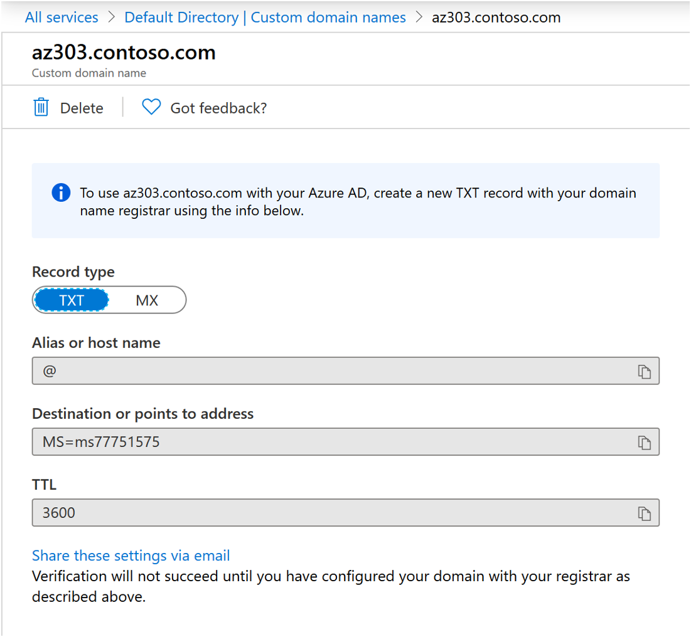
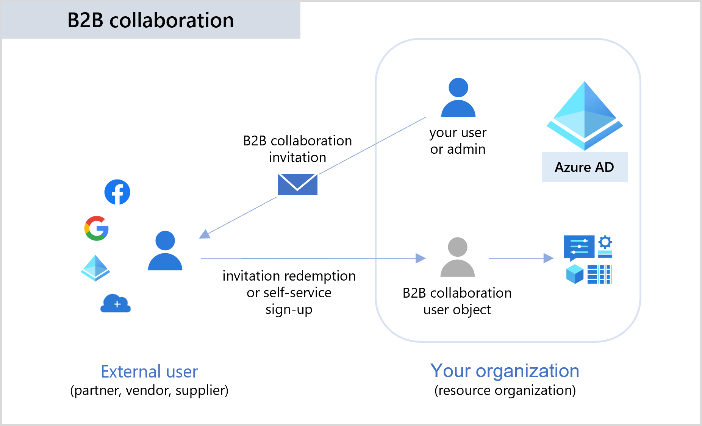
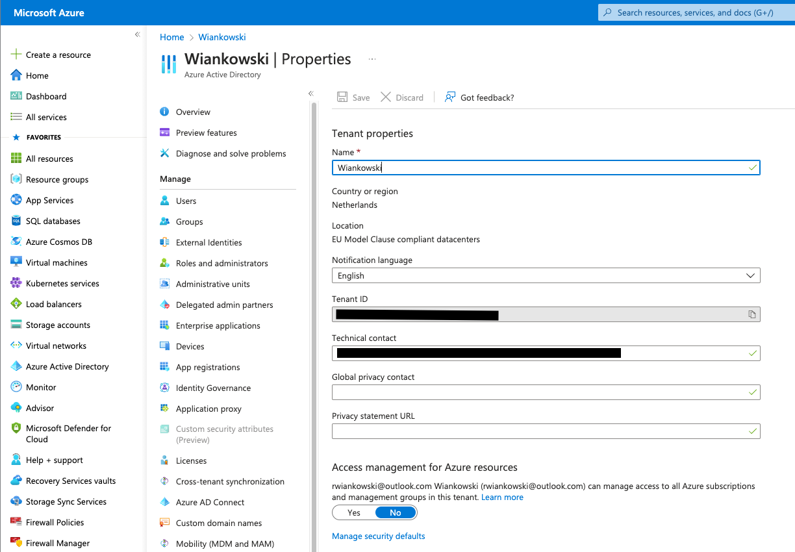
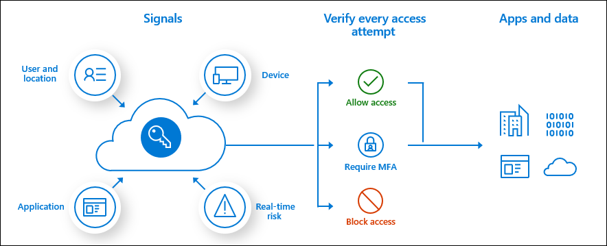
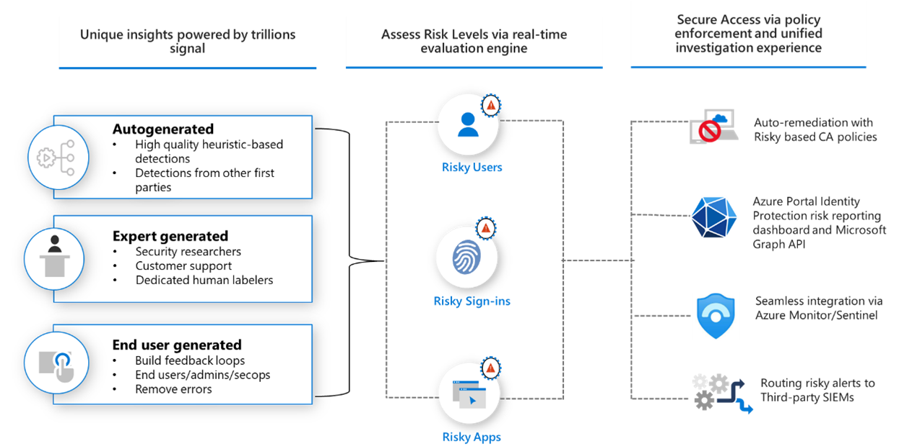

# 1.2 - Entra ID

In this section we will cover the following topics:
- [What is Entra ID](#what-is-entra-id)
- [Entra ID Users and Groups](#entra-id-users-and-groups)
- [Application Service Identities](#application-service-identities)
- [Multi-Domain Setup](#multi-domain-setup)
- [Entra Role Based Access Control](#entra-role-based-access-control)
- [Entra ID Security](#entra-id-security)

## What is Entra ID

Historically, when we got to the part where we talk about identities in Azure, I would say:

>Azure starts with Azure Active Directory (which we often call AzureAD or use the acronym AAD). The name of the service is, however, misleading. While we cannot use Azure without Azure AD, it is not a part of Azure, and many customers use it without ever thinking of deploying any Azure Resources. Azure Active Directory is also the backbone of other cloud-based services offered by Microsoft, like Microsoft 365 and Dynamics 365. 

And as we went on, I would keep repeating:

>Azure AD is not Azure!

Not too long ago, however, Micosoft rebranded Azure AD to Entra ID. And while I'm usually cynical about rebranding exercises, this one does the service justice. I mention this because such changes take a long time to solidify in the minds of people who have been using this technology for years. With that in mind, you'll probably still hear me and others use the name Azure AD, so please remember:

> Azure AD == Entra ID

From a technical perspective, though, the name change doesn't mean much, and you still need Entra ID to use Azure - there is no other way. Even if you want to use a third-party identity management solution like Okta, you will still need to use Entra ID in between.

And before we move on, just one more reminder:

>Entra ID is not Azure!

Today, though I will say - Azure starts with Entra ID (previously called AzureAD and often referred to as AAD). There is no other way. Even if you want to use a third-party identity management solution like Okta, you will still need to use Entra ID in between. So you have no option - you must get to know it well. 

Entra ID is a Software-as-a-Service (SaaS) enterprise Identity and Access Management (IAM) solution. It is a cloud-based and multitenant service that offers:
- **Authentication** - it verifies users' identities and issues access tokens,
- **Authorisation** - it verifies users' access permissions to Enterprise Applications, which can be published via Entra ID.

Entra ID offers a wide range of advanced security, collaboration, and other features besides the core identity and access capabilities. We will only explore some of them, as their scope is big enough to make it into a separate course. 

### Entra ID Glossary

Entra ID introduces a fair bit of new terminology, and it is fundamental to understand what is what. We often use synonyms when referring to the same thing, so become familiar with the essential glossary below.

- **Tenant** - An essential word in our dictionary is the tenant. The tenant (often called a directory or domain) is a dedicated instance of Entra ID. Most commonly, it is intended for use by a specific organisation, but organisations can create additional tenants. As you probably remember from the previous chapter, all subscriptions belong to a single tenant - it is a tree-like structure. Therefore, creating several directories can make your governance very complex. One reasonable exception is separating end-user services like Microsoft 365 and infrastructure-focused Azure into different tenants. Due to the architecture of Entra ID (more on this very soon), such a setup can help with the separation of duties, especially when parts of IT are outsourced. A new ADD tenant was created for you when you signed up for the Azure Free account.
- **Identity** - An Identity is an entity that can be authenticated, for example, a user or an application.
- **Account** - An identity that has data associated with it.
- **Entra ID account** - An identity created through Entra ID or another Microsoft cloud service, such as Microsoft 365. Identities are stored in Entra ID and accessible to your organisation's cloud service subscriptions. This account is also sometimes called a Work or school account.

### Domains and Custom Domains

Every Entra ID tenant has a domain name used to identify the instance of the Entra ID. The initial (mandatory) domain name follows the format:

> \<something of your choice\>.onmicrosoft.com

The domain name must be globally unique because ADD is a multitenant SaaS offering.

The built-in domain name will always be there with you, but you can also add a custom domain name to make your Accounts' User Principal Names (UPNs) more user-friendly.

The process of configuring a custom domain name is relatively simple and quick. It includes the following steps:
- Register a publicly-resolvable domain with a registrar of your choice
- Add the custom name in Entra ID (you will need Global Administrator permissions)
- Create the verification records in your domain's lookup zone (Azure will ask you to create a specific TXT or MX record to verify ownership of the custom name)
- Wait for the DNS change to propagate and complete the process

### Entra ID vs. AD

Active Directory, also known as Active Directory Domain Services (AD DS) or Windows Server Active Directory (WS AD), is a service provided as part of the Windows Server operating system. It acts as a data store for users and devices on a local network and provides authentication and authentication mechanisms. While that description could also fit Entra ID (and there is this naming similarity), it is a fundamentally different service. The key differences are shown in the following table:

| Characteristic | Entra ID | WS AD |
| -------------- | -------- | ----- |
| Structure | Flat - no Organisational Units (OUs) or Groups Policy Objects (GPOs) | Tree-like, with OUs and GPOs |
| Queried using | REST API over HTTP | LDAP |
| Authentication protocol(s) | SAML, WS-Fed, OpenID Connect, OAuth | Kerberos |
| Single Sign-On | Native | Requires AD FS |

Like with WS AD, users' devices can authenticate to Entra ID. However, the situation is slightly more complex, as we have several models available:

- Entra ID-registered devices
    - Intended for the BYOD (Bring Your Own Device) scenarios
    - Users sign in to their devices with local accounts
    - An Entra ID account (work/school) grants access to resources
    - Limited cloud security feature support
    - Supports Windows 10+, iOS, Android and MacOS

- Entra ID-joined devices
    - Intended for cloud-first or cloud-only organizations (implemented only with organization-owned devices)
    - Users can only sign in to their devices with Entra ID accounts (work/school)
    - Rich cloud security feature support
    - Supports Windows 10+ and Windows Server 2019+ (in Azure)

- Hybrid Azure-AD joined devices
    - Intended for hybrid organizations with existing on-premises AD infrastructure
    - Users can only sign in to their devices with organisational accounts 
    - Limited cloud security feature support
    - Supports Group Policy for management
    - Supports Windows 8.1+ and Windows Server 2008+

### Entra ID Editions

In its default form, Entra ID is a free service. However, the free edition has limited benefits and features, so you will want to upgrade to Entra ID Premium in most production scenarios. To understand why, we will look at the following table, which provides an overview of the differences between various Entra ID editions:

| Feature | Entra ID Free - Security defaults (enabled for all users) | Entra ID Free - Global Administrators only | Office 365 | Entra ID Premium P1 | Entra ID Premium P2 |
|---------|----------------------------------------------------------|--------------------------------------------|------------|---------------------|---------------------|
| Protect Entra ID tenant admin accounts with MFA | ● | ● (Entra ID Global Administrator accounts only) | ● | ● | ● |
| Mobile app as a second factor | ● | ● | ● | ● | ● |
| Phone call as a second factor |  | ● | ● | ● | ● |
| SMS as a second factor |  | ● | ● | ● | ● |
| Admin control over verification methods |  | ● | ● | ● | ● |
| Fraud alert |  |  |  | ● | ● |
| MFA Reports |  |  |  | ● | ● |
| Custom greetings for phone calls |  |  |  | ● | ● |
| Custom caller ID for phone calls |  |  |  | ● | ● |
| Trusted IPs |  |  |  | ● | ● |
| Remember MFA for trusted devices	| 	| ●	| ●	| ●	| ● |
| MFA for on-premises applications	| 	|	|	| ●	| ● |
| Conditional access	| 	|	|	| ●	| ● |
| Risk-based conditional access	| 	|	|	|	| ● |
| Identity Protection (Risky sign-ins, risky users)	| 	|	|	|	| ● |
| Access Reviews	| 	|	|	|	| ● |
| Entitlements Management	| 	|	|	|	| ● |
| Privileged Identity Management (PIM), just-in-time access	| 	|	|	|	| ● |
| Lifecycle Workflows (preview)	| 	|	|	|	| ● |

The table, taken from Microsoft's official documentation, could and should be more precise, especially on MFA. In a way, it hides the fact that Multi-Factor Authentication is not included in the free tier. At this point, you might feel the urge to point at the table and correct me. However, the Entra ID free edition only provides MFA for accounts with administrative permissions in the tenant. And that group should be as small as possible.
To get MFA and another handy security feature called Conditional Access, you will need a P1 license. That should be your default for a regular user. However, considering the components required for people who manage Entra ID and Azure Resources, you should go for P2, as it gives you Privileged Access Management.

We will take a closer look at those security features very soon, but first, we need to get more familiar with a few other topics. 

## Entra ID Users and Groups

As you might expect from an IAM (Identity and Access Management) tool, user and group management is the bread and butter of Entra ID. While you won't find any rocket science here, there are a few things to remember, so we'll look at those now.

### Users

In Entra ID, we have three types of users:
- Cloud Identities - created directly in Entra ID either via the portal graphical interface or programmatically as part of a scripted job
- Synchronised Identities - created in Azure by AD Connect - the WS AD synchronisation tool, which we will cover in the next chapter
- Guest Users - created in other Entra ID tenants and invited to your tenant (more on that later in this chapter)

*Pro Tip - when you delete a user in Entra ID, it is only soft-deleted and stays in the "bin" for 30 days. This feature allows you to recover an account deleted by mistake quickly. I've come to appreciate this option more than I'd like*

### Exercise 1.2.1

Until now, you've been logged into Azure with the default administrator account - every Azure tenant gets one upon creation. It is a generic account that anyone within your organisation could use. To follow good security practices, we should refrain from using it. Instead, we should use dedicated and named accounts. We will sort that out a bit later. For now, we will implement another security recommendation.

Unfortunately, it's possible to find yourself in a situation where everyone with administrative permissions in the Azure platform is either unavailable or unable to access it. That is why we always create emergency break-glass accounts that can be used in times of turbulence. That will be our next step.

1. If you're not logged into the Azure Portal, please do so. 
 - Be sure to use the new Microsoft Account you created while signing up for Azure.
2. Find Entra ID in the Portal Menu and navigate to the Users section. Take your time to explore.

*Important - You will probably notice that the user account, created by default, looks strange. It is an external account, even though it is marked as a Member account rather than a Guest. Typically, only Guest Accounts have the #EXT# part in their UPN. It is a unique situation caused by the fact that your brand-new Microsoft account was used to give you access to the Entra ID tenant.* 

3. Create two new accounts in your Entra ID tenant.
 - Use names that are easy to recognise, like emergency1 and emergency2.
 - Once created, rotate the default passwords Azure generated upon creation. 

*Pro Tip! - When learning using a disposable environment, you don't need to worry too much about passwords. However, in a real-life scenario, you should always use strong passwords for the break-glass accounts. I recommend at least 128 characters (the maximum is 256) and storing the passwords as two halves in separate locations. For example, the left side is in a virtual vault, and the right is in a safe.* 

### Groups

When it comes to Groups, in Entra ID, we have two options:
- **Security** manages user and computer access to shared resources. Owners can consist of users and service principals. Members can include users, devices, other groups, and service principals.

- **Microsoft 365** provides collaboration opportunities by giving group members access to a shared mailbox, calendar, files, SharePoint sites, and more. It lets you provide people outside of your organization access to the group. Members can only include users. Owners can consist of users and service principals. 

But next to that, we have several assignment options:
- **Static** - in which you manually (or statically) assign group membership.
- **Dynamic** - in which the platform automatically assigns group membership for users or devices based on their attributes.

*Important - a dynamically assigned group can include only user objects or only devices, never both.* 

### Exercise 1.2.2

We have some users, so let's add a group.

1. Go back to the Azure Portal
2. Navigate to the Groups section in the Entra ID blade.
3. Create a new group
    - I recommend the name "Entra IDministrators" or something similar
    - Make it a statically assigned security group

### Administrative Units

I previously mentioned that Entra ID has a flat hierarchy and does not support Organisational Units like Windows Server Active Directory. There is, however, a feature that attempts to give us a fraction of what OUs did in WS AD - Administrative Units, also referred to as AUs.

AUs can be used to group  Users, Groups, and Devices to delegate administrative tasks. That is both a lot and not enough at the same time - AUs cannot be nested (Entra ID is still flat) and support only certain permissions sets for administrators. Many permissions can only be scoped to the entire tenant.

*Important  - You will need an Entra ID P1 license for every AU administrator. AU members can have a free license.*

## Application Service Identities

If you have experience working in a Windows Server environment, the concept of a service account should feel familiar. Working with applications that relied on Active Directory, we would create a regular domain user. Then, instead of giving it a human name, we would follow the naming convention for a service account and run a service in the context of that security principal. This way, we could permit that service to access file shares, databases, and other resources.

In Azure, we use different mechanisms. We will look at them in the following sections.

### Service Principals

The first option is to use Service Principals (SPNs), which you can find in the Azure portal under App Registrations. An SPN is an Entra ID identity that an application (can be external) will use to authenticate to Azure resources. The authentication can use a secret (password) or a certificate.

In the simplest scenario, once you've imported the correct library into your source code, you need to pass the SPN ObjectId and the secret value to the application, and it can authenticate against Entra ID.

### Managed Identities

Service Principals work well and are easy to use, but they come with a significant drawback - they leave you responsible for generating, securing, and managing credentials. In a growing environment, that task can become an impactful burden. But, thankfully, Managed Identities come to the rescue.

A Managed Identity is an Entra ID Service Principal managed by Azure. This short sentence above can take a few moments to sink in, but it is essential. As you hopefully remember, Entra ID is not Azure, but Managed Identities are one of the few places where the two services blend. An Entra ID security principal, represented and managed by Azure Resource.

A Managed Identity can be associated with an Azure Resource and used by that resource to access a target that supports Entra ID authentication and Azure RBAC. For example, we can assign it to a Function App and permit it to access a Storage Account. However, we never touch its credentials throughout this process and the remainder of the identity's lifecycle. Those are generated and periodically rotated by Azure.

Managed Identities come in two flavours, and both have their use cases. The table below provides a comprehensive overview:

| Property | System-assigned managed identity | User-assigned managed identity |
| --- | --- | --- |
| Creation | Created as part of an Azure resource | Created as a stand-alone Azure resource |
| Life cycle | Shared life cycle with the Azure resource | Independent life cycle Must be explicitly deleted |
| Sharing across Azure resources | Cannot be shared Can only be associated with a single Azure resource | Can be shared Can be associated with more than one Azure resource |
| Common use cases | Workloads that are contained within a single Azure resource For example, an application that runs on a single virtual machine | Workloads that run on multiple resources and which can share a single identity Workloads that need pre-authorization to a secure resource as part of a provisioning flow. Workloads where resources are recycled frequently, but permissions should stay consistent. |

## Multi-Domain Setup

Microsoft will (almost) always recommend having only a single Entra ID tenant. They have good reasons to provide such recommendations, and in many cases, it's the best option. But there are situations in which you need to use several Entra ID domains.

Those special situations include the following:
- As part of a regulatory compliance framework, you need to separate the tenant of your production environment from any non-production environment.
- You work for a globally distributed enterprise, and data residency laws require storing data within a specific geographical region. 
- You plan on outsourcing parts of your IT landscape to a 3rd party and want to retain a clear separation of duties. Remember - Entra ID has a flat structure, and some permissions can only be granted on the scope of the entire directory. AUs help with some things, but often we need more.
- You work for a managed service provider and must use a separate tenant for each customer.

I excluded from the list above a sandbox tenant you might use individually or in a shared setup with a limited group to learn and try new features and services. That is an extra one for the considerations above.

*Important - If you choose or are forced to use a multitenant setup, I strongly recommend keeping the number of directories to the minimum and paying particular attention to securing each one with adequate measures. Each of those tenants is a liability!*

### Entra ID Business-to-Business Collaboration

When you end up having multiple tenants, you could keep them completely isolated and create duplicate user accounts (and potentially groups) in every one of them, but that would be impractical. Also, you would eventually face configuration drift and potentially expose security vulnerabilities.

Thankfully, we have Entra ID Business to Business (Entra ID B2B) collaboration to mitigate this challenge. The service allows us to invite an Entra ID account from one tenant as a guest user in another tenant. If you remember Guest Users from earlier in this chapter, that was Entra ID B2B.
When you invite an external account into your tenant, your directory only stores a reference (pointer) to the Entra ID account in another tenant. When the user tries to authenticate, they are redirected to their home tenant, and once they obtain an authentication token, they are redirected back and authorised.

As a result, you can use a single Entra ID account to access multiple Entra ID tenants. 

This service also works great when you want to give users from partner organisations access (like vendors and service providers) to a part of your Azure environment. Instead of creating (and managing) Entra ID accounts for them, you can invite them and let them use their existing identities.

In the example above, I talk about one Entra ID tenant inviting users from another ADD as guest users, but there are other options. You can also invite Microsoft, Google, Facebook (though with limitations) and other accounts. However, those scenarios are rare, and in many cases, they are not good practice. If you use someone's work or school account, you can be reasonably confident that that account will be disabled or removed when they leave the organisation. On the other hand, inviting someone using their personal Microsoft account will place that responsibility on you. 

*Pro Tip! - The challenge I describe above can also be solved using Access Packages. We will not look at them here, but I encourage you to add the [official documentation](https://learn.microsoft.com/en-us/azure/active-directory/governance/entitlement-management-access-package-create) to your reading list, as several valuable use cases exist for that functionality.* 

### Microsoft Entra External ID

Azure also offers a business-to-customer service used to manage end-customer identities and their access to your applications. 

When using Extrenal Entra ID, we create a seprate, use case-specific directory which can authenticate and authorise end users. 

Entra External ID offers a wide range of handy features like:
- Support for various identity providers (e.g., Google, Facebook, LinkedIn, or other Azure AD tenants).
- Multiple authentication options, including social identities, email OTP (One-Time Passcode), and custom identity providers.
- Self-Service Registration and Profile Management.
- Conditional Access and Security Policies.
- Customizable User Journeys wth create branded, personalized experiences for external user onboarding and authentication flows.
- Delegate user and access management to external administrators within their partner or customer organizations.

*There is also a older version of this service called Azure AD B2C - Business to Customer.*

### Exercise 1.2.3

Until now, you've been working with your Azure environment using the default administrator account, and we already established that it is not a good practice. I also promised that we would fix that issue soon, and the time is now.

1. Version A - If you have an Entra ID work or school account that you use daily, invite your user to the tenant you created for learning purposes
1. Version B - If you don't have an existing work or school account, create a new named user in your new tenant.
2. Add the new user to the "Entra IDministrators" group, which you created in exercise 1.2.2

## Entra Role Based Access Control

In the previous chapter, we explained how Role-Based Access Control works for Azure, but we never mentioned anything about Entra ID. But, since "Entra ID is not Azure", it has its own RBAC stack.

### How it works

Thankfully, Entra ID RBAC works almost the same as with Azure:

>You create an *assignment* of a *role definition* to a *security principal* at a particular *scope*.

The main difference lies in the scope - while Azure can have an elaborate management hierarchy with several levels eligible for assignments, Entra ID is flat. We assign Entra ID RBAC roles to the entire tenant (and sometimes AUs).

### Role Definitions

Because Entra ID is used for all cloud-based services offered by Microsoft, not just Azure, it has a long list of built-in role definitions. Most of those you will probably never need, but some are worth taking a closer look at:

1. Global Administrator can:
 - Manage access to all administrative features in Entra ID, as well as services that federate to Entra ID
 - Assign administrator roles to others
 - Reset the password for any user and all other administrators

2. User Administrator can:
 - Create and manage all aspects of users and groups
 - Manage support tickets
 - Monitor service health
 - Change passwords for users, Helpdesk administrators, and other User Administrators

3. Billing Administrator can:
 - Make purchases
 - Manage subscriptions
 - Manage support tickets
 - Monitor service health

Apart from those three, I highly recommend that you check out GlobalReader, Groups Administrator, Application Administrator, and Security Administrator in the [official docs from Microsoft](https://learn.microsoft.com/en-us/azure/active-directory/roles/permissions-reference)

*IMPORTANT - Global Administrator is the highest permission level in Entra ID. The role allows you to do anything - the equivalent of root.

### Exercise 1.2.4

In the previous exercises, you created and possibly invited additional Entra ID Accounts to your new directory, but we never assigned any permissions to those identities. Those accounts cannot perform administrative tasks without an Entra ID RBAC assignment. Let's fix that!

1. Go back to the Azure Portal
2. Use the Entra ID blate to:
    - Assign the "Global Administrator" permissions directly to the break-glass accounts you created in exercise 1.2.1
   - Assign the "Global Administrator" permissions to the Administrators group you created in exercise 1.2.2

With that, all your administrative user accounts should have the correct permissions. 

### Where Entra ID RBAC meets Azure RBAC

The Global Administrator role is another one of the few places Entra ID and Azure come together. If you have this Entra ID role, you can navigate to the Properties section of the Entra ID blade in the Azure Portal and use the option "Access management for Azure resources". Doing this will give you the User Access Administrator RBAC role in Azure RBAC (on the entire hierarchy). With that, you could create an assignment giving yourself the Owner permissions on any part of the Azure landscape.

**Therefore, the Global Administrator role gives you unrestricted access to Entra ID and effectively to the entire Azure hierarchy within the tenant.** 

### Exercise 1.2.5

You're almost done with configuring the identities in your new Entra ID tenant. Now is the time to switch from the built-in administrator account provided when you signed up for a Free Trial (or Azure Pass) to a dedicated, named account.

1. Version A - if in exercise 1.2.3 you invited your work/school account - Switch to your regular browser window and go to https://portal.azure.com. Once you log in, change your directory perspective to the new tenant - it will probably be called "Default Directory", and the domain name will include the address of the email account you created for your learning purposes. 
1. Version B - if in exercise 1.2.3 you created a new named account - open a new private browser window and log in with that account.
2. Go to Entra ID blade and verify your Global Admin permissions. If yes, you can close the private browser window with the built-in admin account. We won't be needing it any more. Otherwise, ensure your dedicated user is a Global Admin.
3. Try finding your Azure Subscription. You shouldn't be able to do it. Use the "Access management for Azure resources" option to grant yourself Owner permissions on the Tenant Root Management Group.

## Entra ID Security
Finally, we will dive into some security features Entra ID offers. We won't cover everything - we will focus on those I consider fundamental to maintaining a solid baseline security posture and those you might encounter during the exams. Also, remember that Entra ID is developed very dynamically - Microsoft is probably releasing new features as I write these words, so [check the documentation for the latest and greatest](https://learn.microsoft.com/en-us/azure/security/fundamentals/identity-management-overview). 

### Conditional Access

One of the fundamental security features of Entra ID is Conditional Access. The feature analyses various signals to automate decisions and enforce organisational access policies.

The signals include, but are not limited to, the following:
- user identity and group membership,
- device platform,
- location,
- sign-in risk,
- client application.

Conditional Access policies are like if-then statements allowing or blocking access, enforcing multi-factor authentication, or restricting the user's session. 
You can create up to 195 policies in every Entra ID tenant but try to keep the number as low as possible and pay attention to how you name them. Reviewing a long list of configurations will make troubleshooting a painful experience, but even a short list will cause problems if your naming is inconsistent. Conditional Access configuration is not a place we look often, so in most cases, you'll need to remember the details just a few weeks after you define your settings. Name them well, and your life will be easier!

Remember that Conditional Access will require Entra ID Premium - P1 for most features and P2 for Identity Protection. You will need the Security Administrator or Conditional Access Administrator RBAC role to configure the component. Global Administrator, as always, can do anything. 

When you create a new policy, you can leave the default setting "Report-only" to evaluate its behaviour before you start limiting users' sign-ins. But to ensure the security limitations you configure are in place, you must flip the switch to "On".

Setting up conditional access is one of the first things I recommend configuring in your Entra ID tenant. Start with a simple set to provide a solid security baseline and build on top of that - limiting access to the Azure Management plane and enforcing MFA for all users should be sufficient. Do exclude your break-glass accounts, though!

### Exercise 1.2.6

The best way to learn about Conditional Access policies is to configure them yourself, so that's what we will do now.

1. Make sure you're logged into the Azure Portal.
2. Enable a free trial of the premium features on your Azure tenant.
    - Check the Licenses tab under Entra ID,
    - Go for Premium P2
    - Remember to assign the license to your user 
3. Navigate to the Entra ID blade, Security tab and there you will find Conditional Access
4. Create three new Conditional Access policies:
    - Block access to the "Microsoft Azure Management" application from anywhere except your office/home public IP address.
    - Allow access for all users to all applications, but enforce Multi-Factor Authentication.
    - Disable legacy authentication
5. Make sure all policies are on!

*I strongly recommend excluding the break-glass accounts from the first policy. You want to be able to access the Azure Management plane in case of an emergency, and that can include situations in which you don't have access to any of your trusted locations.*

### Multi-Factor Authentication

Multi-Factor Authentication (MFA) is another fundamental security feature of Entra ID. It requires users to verify their identity by providing two or more forms of authentication. Those forms include the following:
- something you know, like your account password
- something you are, like your fingerprint or face/eye scan
- something you have, like a security key or your smartphone

The MFA service provided by Entra ID supports the following forms of additional verification:
- Microsoft Authenticator
- Windows Hello for Business
- FIDO2 security key
- OATH hardware token 
- OATH software token
- SMS
- Voice call

For a long time, MFA settigs were managed primarilly using the "Per-User MFA authentication" settings as part of a legacy interface for configuring MFA settings. That standalone site was recently deprecated and we now manage MFA settings via an integrated experience. If you sill have any legacy MFA policies, you shoud migrate them to the new experience. The details of the migration are described [here](https://learn.microsoft.com/en-gb/azure/active-directory/authentication/how-to-authentication-methods-manage).

Multi-factor authentication is a relatively simple yet potent protection mechanism. A common saying reminds us that "identity is the new perimeter", and enforcing MFA is the best thing we can do to help secure users in your organisation.

### Identity Protection

Entra ID Identity Protection is a security service that detects potential vulnerabilities in your organisation's identities. It uses existing anomaly-detection capabilities and introduces new risk-detection types based on Microsoft's experience in Entra ID, Microsoft Accounts, and Xbox. Trillions of signals are analysed daily to identify and protect customers from threats.

Identity Protection's signals can be used with Conditional Access or a security information and event management tool. It detects risks like:
- anonymous IP address use,
- atypical travel,
- malware-linked IP address,
- unfamiliar sign-in properties,
- leaked credentials,
- password spray,
- and others.

### Access Reviews

Organisations can use Entra ID access reviews to manage group memberships, access to enterprise applications and privileged role assignments efficiently. 
Self-service capabilities have made it convenient for users to join groups, invite guests, connect to cloud apps, and work remotely from their work or personal devices. However, this convenience has led to a need for better access management capabilities. As new users join, ensuring they have the access they need to be productive is essential. Similarly, removing their old access when they move teams or leave the company is critical. Excessive access rights can lead to compromises and result in audit findings, indicating a lack of control over access. To proactively manage access, resource owners should regularly review who has access to their resources.

Access reviews should be used in scenarios such as when there are too many users in privileged roles, and automation is not possible. For example, it is good to check how many users have administrative access and how many are Global Administrators.
For specific resources, it might be required as part of compliance processes to ask people to reconfirm and justify why they need continued access regularly. Finally, recurring access reviews can be set up for users at set frequencies such as weekly, monthly, quarterly or annually, and the reviewers will be notified at the start of each review. 

Depending on the access you want to verify, you will want to use a different service/feature:

| Access rights of users | Reviewers can be | Review created in | Reviewer experience |
|------------------------|------------------|-------------------|---------------------|
| Security group members Office group members | Specified reviewers Group owners Self-review | access reviews Entra ID groups | Access panel |
| Assigned to a connected app | Specified reviewers Self-review | access reviews Entra ID enterprise apps (in preview) | Access panel |
| Entra ID role | Specified reviewers Self-review | PIM | Azure portal |
| Azure resource role | Specified reviewers Self-review | PIM | Azure portal |
| Access package assignments | Specified reviewers Group members Self-review | entitlement management | Access panel |

### Security Defaults
Every new Entra ID tenant is preconfigured with security defaults to make things easier for customers. It's a great starting point, but there are a few critical yet inconspicuous details. Let's take a look at Microsoft's description:

>Security defaults make it easier to help protect your organisation from these identity-related attacks with preconfigured security settings:
>- Requiring all users to register for Entra ID Multifactor Authentication.
>- Requiring administrators to do multifactor authentication.
>- Requiring users to do multifactor authentication when necessary.
>- Blocking legacy authentication protocols.
>- Protecting privileged activities like access to the Azure portal.

If you read it carefully, you'll notice that all users must register for MFA, but only administrators will be challenged with a second factor upon every sign-in. Non-administrator users must only respond to an MFA challenge when necessary. However, the documentation is very vague about the circumstances that define the necessity. 

>Entra ID decides when a user will be prompted for multifactor authentication, based on factors such as location, device, role and task.

Therefore, getting a false sense of safety regarding the MFA configuration provided by the security defaults is relatively easy. Multi-Factor Authentication, in the most functional form, is only available with Entra ID Premium.

### Improving Security

While I appreciate the security defaults as built-in protection, I need more. I would want my organisation to use more than the baseline level of protection, so I recommend you follow my hardening guide consisting of the steps listed below:
- Get Entra ID Premium for all your users. Many of you might find it controversial due to the associated costs, but damage control after a security breach is usually more expensive. It's a good investment. Get a P1 license for all standard users and a P2 for Azure operators/ administrators. The latter gives us Entra ID PIM, which we will cover in the next chapter, but it is another must-have feature.
- Disable the security defaults.
- Create three new Conditional Access policies to:
    - Block access to the "Microsoft Azure Management" application from anywhere except your office/VPN IP ranges (exclude the break-glass accounts).
    - Allow access for all users to all applications, but enforce Multi-Factor Authentication (exclude the break-glass accounts).
    - Disable legacy authentication protocols.
- Configure the following Entra ID User Settings:
    - Set 'User can register applications' to No
    - Set 'Restrict non-admin users from creating tenants' to No
    - Set 'Restrict access to Entra ID Administration portal' to yes
    - Set 'Allow users to connect their work or school account with LinkedIn' to No
- Configure the Entra ID User Settings External collaboration Settings:
    - Set 'Guest user access restrictions' to 'Guest users have limited access to properties and memberships of directory objects' 
    - Set 'Guest invite restrictions'  to 'Only users assigned to specific admin roles can invite guest users 
    - Set 'Enable guest self-service sign up via user flows' to NO
    - Set 'Allow external users to remove themselves from your organisation to Yes
    - Set 'Collaboration restrictions' to 'Allow invitation only to the specified domains (most restrictive) ' and, if needed, and only the desired target domains.

### Exercise 1.2.7

You already covered the first part of the list above in the previous exercise - to configure the Conditional Access policies, you had to get the premium licenses and disable the security defaults. But there are still a few things to tweak:
1. Configure the Entra ID User Settings from the list above
2. Configure the Entra ID User Settings External collaboration Settings from the list above

[<  1.1 Azure Governance](./azureGovernance.md) | [Home - Course Contents](../Contents.md) |  [1.3 - Hybrid Identity >](./hybridIdentity.md))