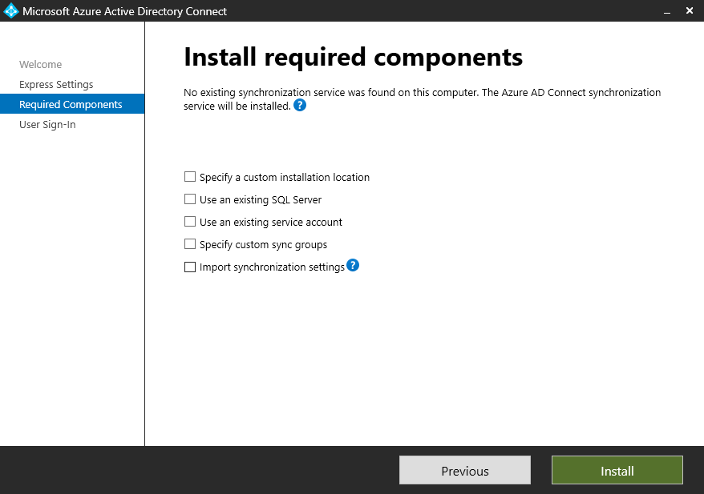
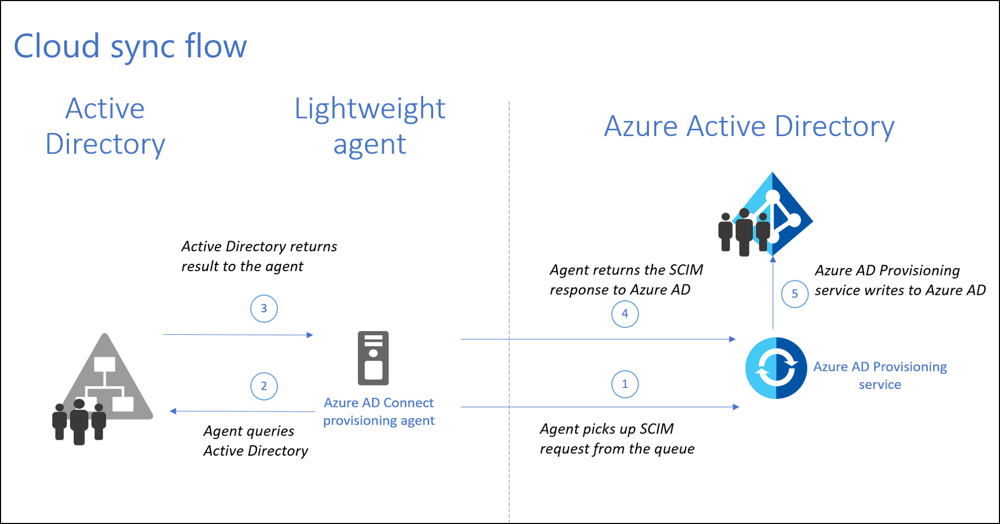
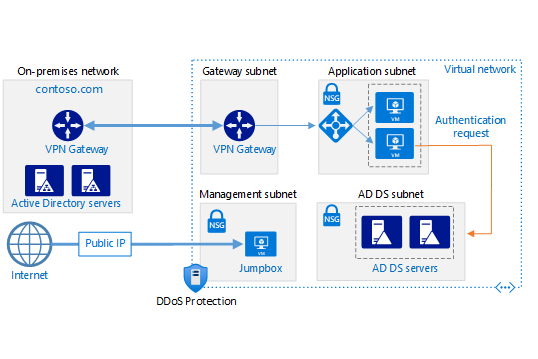
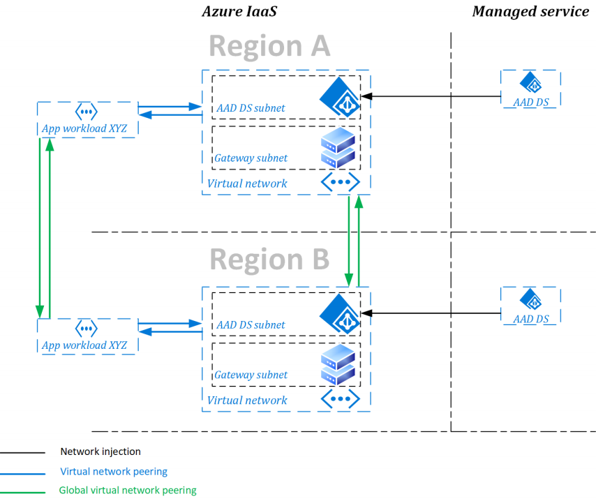

# 1.3 - Hybrid Identity

## Why a Hybrid Identity?

In the previous, rather lengthy chapter, we looked at Azure Active Directory and how it forms the absolute foundation of any Azure landscape. We also discussed the differences between Azure AD and Windows Server Active Directory Domain Services. While such a comparison might have felt redundant for some readers, I consider it crucial for anyone from the Windows Server ecosystem. 

Active Directory (AD), which we often refer to today as WS AD or AD DS, was previewed in 1999 and made publicly available with the release of Windows Server 2000. It provided authentication and authorisation for users and devices on a Windows-based network environment. As a core component of many enterprise-grade business applications including, but not limited to, Microsoft's own Exchange, SharePoint and Dynamics, it quickly became one of the essential services. 

As a result, when a decade later, Microsoft launched Azure, many organisations were long-time users of Active Directory Domain Services. They had, sometimes extensive and complex, deployments of AD that had all the information about their users, group assignments, computers and more. Allowing organisations to bring those identities to their cloud environments made sense. Thankfully, Microsoft was already getting AD DS identities into the cloud for the Business Productivity Online Standard Suie, the predecessor of Officer 365.

## Directory Synchronisation

### Introducing Azure AD Connect

After several name changes and several updates, we ended up with a tool called Microsoft Azure Active Directory Connect. AAD Connect is an application installed locally within your Windows Server ecosystem, either on a dedicated virtual machine or on one of the domain controllers. It will connect to your Azure AD tenant and orchestrate synchronising your WS AD objects to Azure AD. 

The installation process is pretty straightforward. I recommend using the custom settings mode, even if only using a dedicated service account. You can also specify a SQL server if you have a shared database instance that you use for the smaller apps in your environment. 

The tool does need an MS SQL Database instance, so if you don't specify a custom one, the tool will install SQL 2019 Express as a default. Be mindful of the capacity consideration, as MS SQL does tend to consume as much memory as possible.

Once the required components are installed, you must make the most crucial choice in your AD Connect deployment - the sign-in method. 

### Three modes of sign-in

Azure AD Connect offers three sing-in modes that provide different options:
- Password Hash Synchronisation (PHS) will store a copy of the password hash (not clear text) in the cloud. Depending on your compliance framework, this might not be a viable option. It is, however, the most convenient one. With PSH, your AzureAD sign-ins don't rely on any on-prem infrastructure, so outages and maintenance won't be a problem. Also, with password write-back, users can change their passwords in AzureAD, which will get synchronised back to WS AD. There is also the Self-Service Password Reset (SSPR) option that you can enable in Azure AD for maximum gains. Depending on the size of your organisation, using SSPR can provide significant savings in support costs. 
- Pass-Through Authentication (PTA) will use the authentication agents installed on-premises for user sign-ins. It's as straightforward in deployment as PHS, but sing-ins will depend on the on-premises infra. That's why you should aim to deploy multiple authentication agents for high availability.
- Federation with either AD FS or PingFederatare. The latter is a relatively new option, and I've never tried using it. There the official documentation will be your best bet. I have, however, used AD FS many times, and unless you already have it or badly need one of the features only supported in this mode, I recommend avoiding it. AD FS requires several on-premises servers for a proper, highly available deployment (two federation servers, two federations proxy servers, and an MS SQL database), so it comes at quite a high cost. Both in terms of infrastructure and the management overhead. 

The table below offers a comparison of features between the three options:

| Option | PHS and SSO | PTA and SSO | AD FS |
| --- | --- | --- | --- |
| Sync new user, contact, and group accounts created in my on-premises Active Directory to the cloud automatically. | X | X | X |
| Set up my tenant for Office 365 hybrid scenarios. | X | X | X |
| Enable my users to sign in and access cloud services using their on-premises password. | X | X | X |
| Implement single sign-on using corporate credentials. | X | X | X |
| Ensure no password hashes are stored in the cloud. |   | X | X |
| Enable cloud-based multi-factor authentication solutions. | X | X | X |
| Enable on-premises multi-factor authentication solutions. |   |   | X |
| Support smartcard authentication for my users.4 |   |   | X |
| Display password expiry notifications in the Office Portal and on the Windows desktop. |   |   | X |

You can also choose not to configure an Azure AD Connect sign-in method if you want to handle it via a federated third-party tool. 

Once you've made the critical decision regarding user sing-ins, you'll have to configure a few other settings regarding the synchronisation scope. Choose the domains and OUs and configure filtering. If you want to enable password write-back, you'll find this option in the "Optional Features" section of the setup wizard. 

### Azure AD Connect Health

Directory synchronisation can be a critical component of your hybrid cloud environment. But even if you don't find yourself overly reliant on Azure AD Connect, monitoring synchronisation for any issues is a good idea. AAD Connect Health is a service designed just for that. You can find it in the Azure Portal under the Azure Active Directory blade in the Azure AD Connect section. 

The tool will provide rich insights into alerts, performance and usage metrics. To install and configure the monitoring agents, [follow the official documentation](https://learn.microsoft.com/en-us/azure/active-directory/hybrid/connect/how-to-connect-health-agent-install#install-the-agent-for-ad-fs). 

### Azure AD Connect Cloud Sync

In 2019 Microsoft released a more modern replacement for Azure AD Connect - AAD Connect Cloud Sync. Since then, the tool has been under development, and at the time of writing, it almost offers functional parity compared to its predecessor. 

The new service moves the synchronisation engine from on-premises to a cloud-based service (as the name might have indicated). As a customer, you still need to install an agent application, but Microsoft describes it as a "lightweight agent". No more MS SQL is required, not even the express edition. Besides that, the new version also provides support for:
- Connecting to multiple disconnected on-premises AD forests
- Deploying multiple active agents for high availability

Some features of Azure AD Connect are still not there, so check the [Azure AD Connect Cloud Sync documentation](https://learn.microsoft.com/en-us/azure/active-directory/hybrid/cloud-sync/what-is-cloud-sync) before choosing. For example, Pass-Through Authentication is no longer available, so you will have to synchronise password hashes or use the federated model.

However, the two tools can coexist in a single environment, so you can mix and match based on what you need. The limitation is that both services cannot synchronise the same AD object, so you will need a domain- or OU-level scoping. 
Also, please keep in mind that once the new tool catches up on the missing functionality, Microsoft will start phasing out Azure AD Connect.

## Active Directory in Azure

Getting our Active Directory users and groups synchronised to Azure AD is handy. Still, it is only one of the two sides to hybrid identity in Azure. More often than not, especially when working with applications designed for the  Windows Server ecosystem, you will need traditional Active Directory Domain Services in your Azure environment. 

When that's the case, you have two options:
- Extend your existing AD DS to Azure
- Deploy Azure AD Domain Services

We'll look at both to understand which one might be the better choice in your circumstances.

### Extending AD to Azure

The typical case is deploying Active Directory Domain Controllers (DCs) to your Azure environment. If you're new to Active Directory, the DC is the primary component, and you will need at least one, although the best practice tells us to have at least two. When you deploy additional Domain Controllers, the service will handle replication and high availability automatically, but there are a few things to keep in mind:
- Domain Controllers need a direct line of sight between each other. That is a local/private network connection. You don't need a full mesh topology if you have many DCs, but any domain controller will need a replication partner. So, if you're extending your AD to Azure, you must **configure a site-to-site VPN or an ExpressRoute** to provide that level of connectivity. 
- Domain Controllers are also used as name resolution servers (AD DS is tightly coupled to DNS), **so set static private IP addresses on those virtual machines**.
- Active Directory operates with the concept of sites, which represent physical network locations where you want the service available. The mechanism dates back to when we had slow and low-throughput connectivity, but it helps clients identify the closest DC. **Configure at least one new site for your Azure environment. You will usually want two domain controllers per site for HA.** 
- Another essential concept in AD is the Global Catalogue (GC) role, which stores information regarding all objects in the Active Directory Forest. **Ensure at least one (but ideally two) DC per site has the GC role installed.**
- **Ensure all controllers in your site have their connectivity requirements for replication met**, and provide the same towards another site with a GC role installed. [See the documentation for detailed information](https://learn.microsoft.com/en-us/troubleshoot/windows-server/identity/config-firewall-for-ad-domains-and-trusts).
- Finally, configure the Domain Controllers in Azure to store their database, logs and sysvol on a data disk, not the OS disk, and **ensure the disk has the "Host Cache Preference" setting on the data disk to "None"**.

*IMPORTANT - the above information is an abridged and condensed extract. Active Directory is a vast topic as the service has many advanced features and options. My goal is to give you enough to get you going and ensure you won't shoot yourself in the foot. You'll find more information [here](https://learn.microsoft.com/en-us/azure/architecture/example-scenario/identity/adds-extend-domain), but if AD DS is a complete unknown, I recommend you seek support from someone with experience.* 

The resulting topology of extending one's Active Directory to Azure can be complex and costly. The figure below provides a good overview. If the icons and names still make little sense to you, worry not — we will go into each of them in detail in the coming chapters. 

### Azure AD Domain Services

If setting up and managing the entire stack of resources needed to extend your Active Directory to Azure seems too much, there is a managed service that does the same thing. In a way.

If Azure AD Connect synchronises Active Directory with your Azure AD tenant, Azure AD Domain Services sets up an opposite data flow. The service will deploy Domain Controllers, configure Active Directory Domain Services and set up the synchronisation from your AzureAD tenant towards AD.
As a result, you get a managed Active Directory Domain Services environment connected to the Azure Virtual Network(s) of your choice. you can deploy multiple instances, or replica sets, even across multiple Azure regions. Each replica set will consist of two Domain Controller configured in a zone-redundant topology (if the region supports Availability Zones).

If it's starting to sound too good to be true, it actually is. Although AAD DS is a fantastic service, several limitations will dictate whether the managed AD offering is for you or you will be forced to go the traditional route.

The most critical limitations include the following:
- You cannot connect to the Domain Controllers via Remote Desktop -they are managed for you by the platform and unavailable. To manage your AD domain, you must install the MMC snap-in on any domain-joined VM and use it for remote management.
- Although, Azure AD Domain Services does not give you access to the Domain Administrator nor the Enterprise Administrator privileges. Upon deployment, a new Azure AD security group will be created - Azure AD DC Administrators and members of that group will have (limited) administrative permissions in the managed domain.
- As a result, you cannot perform any schema updates.
And you get confined to a handful of Organisational Units in the managed domain - AADDC Users, AADDC Computers, AADDCDomainAdmin, AADDCDomainConfig.
- Finally, AAD DS doesn't support guest users invited via Azure AD B2b collaboration. While the user's accounts will get synchronised from Azure AD to Azure AD Domain Services, the passwords for those users are always stored in their home directories. As a result, the hashes cannot be synchronised to AAD DS.

There are a few other limitations, but if you're interested, I'll have to send you to the official documentation [here](https://learn.microsoft.com/en-us/azure/active-directory-domain-services/faqs) and [here](https://learn.microsoft.com/en-us/azure/active-directory-domain-services/compare-identity-solutions).

If none of the features unavailable in the managed Active Directory Domain Services offering is crucial to your use case, I recommend seriously considering Azure AD DS. While you can get a better deal, looking purely at consumption cost, with a pair of virtual machines, the cost of managing, securing, updating and protecting those VMs cannot be underestimated.

[ <- 1.2 - Azure Active Directory](azureActiveDirectory.md) | [ 1.4 - Managing Azure -> ](managingAzure.md)