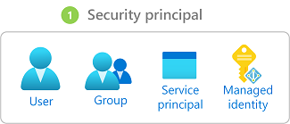
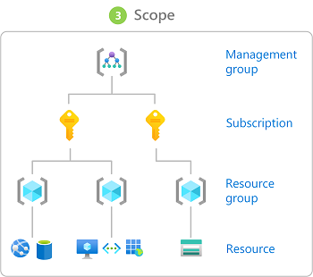

# 1.4 - Managing Azure

In this section we will cover the following topics:
- [Resource Manager](#resource-manager)
- [Azure Portal](#azure-portal)
- [PowerShell and AZ CLI](#powershell-and-azure-cli)
- [Cloud Shell](#using-the-cloud-shell)
- [Infrastructure as Code](#infrastructure-as-code)
- [Azure Policy](#azure-policy)
- [Azure RBAC](#azure-rbac)
- [Privileged Identity Management](#privileged-identity-management)

## Resource Manager

## Azure Portal

The Azure Portal is the primary method of deploying and managing Azure Resources. It is available at [https://portal.azure.com](https://portal.azure.com) and offers a clean, (mostly) user-friendly, and customisable experience. 

## PowerShell and Azure CLI

For keyboard warriors (aka engineers), we have two command-line interfaces: PowerShell and Azure CLI. Powershell is naturally used across the Microsoft portfolio of systems and applications, so to work with Auzre, we only need to install the required modules. The CLI is a standalone, Python-based command-line tool. 

The primary difference is that PowerShell is an Object-Oriented language, while the CLI is text-based. Whatever we do in PS returns an object, so if we save it to a variable, we can easily work with it further.
On the other hand, the CLI is much easier to work with in terms of maintenance. When many PowerShell modules are installed, the overhead of keeping everything up to date and functioning can become a burden.

Functionally, both tools are on par. Most services yield similar results with both tools, although some tasks may be easier to accomplish with PowerShell or the CLI. However, the ultimate decision rests on your personal preference, respecting your individual workflow and style.

### Installing and running the Commandline tools locally

#### PowerShell 

Install on macOs:

```
➜ brew install powershell
➜ pwsh
```

On Windows, PowerShell is installed by default, so just run it.

To manage Azure and EntraID, we need to install the required modules:

```
➜ Install-Module Az
➜ Install-Module Microsoft.Graph
```

And connect ourselves to the management plane:

```
➜ Connect-AzAccount
```

If you are working in an environment with multiple Entra ID tenants, i.e., when we use Entra ID B2B to access customer tenants, add the tenantId parameter:

```
➜ Connect-AzAccount -TenantId "155818ae-0845-4763-90b9-8416edad2204"
```

We then have to select the subscription to work with:

```
➜ Get-AzSubscription
➜ Set-AzContext -SubscriptionName "Visual Studio Enterprise"
```

#### Azure CLI

Install on macOS:

```
➜ brew install azure-cli
```

Install on Windows:
After installing it, we are good to go — no need to install any modules or additional tools. We can start issuing commands by invoking the command-line tool with the az alias. We do still need to authenticate to Azure:

```
➜ az login
```

We also need to select the subscription we want to work with:

```
➜ az account set --subscription  "Visual Studio Enterprise"
```

### Running tools from DOCKER Containers

If you want to run the tools locally but would rather avoid installing them, you can run them from a DOCKER container.

#### PowerShell

```
➜ docker run -it mcr.microsoft.com/azure-powershell pwsh
```
You can find more info regarding the available options here: https://learn.microsoft.com/en-us/powershell/azure/azureps-in-docker?view=azps-9.2.0

#### Azure CLI

```
➜ docker run -it mcr.microsoft.com/azure-cli
```

You can find more info regarding the available options here: https://learn.microsoft.com/en-us/cli/azure/run-azure-cli-docker

### Using the Cloud Shell

If you prefer not to do anything locally, you can use the Azure Cloud Shell. It is a Command Line in the browser with many pre-installed popular tools (including PowerShell and Azure CLI). It offers persistent storage, although I recommend using the Advanced Setting when prompted on the first run to be conscious about the underlying config. It will ask you to create a Storage Account and a File Share that it will use to store the home directory. 

As a significant upside, by running Cloud Shell, you are pre-authenticated to Azure, and all tools are always up to date. 
You can launch Cloud Shell from the portal - https://portal.azure.com or to https://shell.azure.com.

## Infrastructure as Code

Infrastructure-as-Code is a methodology for deploying cloud resources in which the infrastructure components are programmatically defined, managed, and deployed like source code.

Azure offers two native favours of the exact mechanism - ARM and Bicep. ARM templates are the early, JSON-based implementation, while Bicep is a much later addition which offers an improved authoring experience similar to Hashicorp's Terraform. Importantly, Bicep is a Domain-Specific Language that only acts as syntactic sugar on top of ARM, and the two tools are mutually compatible. An ARM template can be converted to a Bicep template and vice-versa.

Other Infrastructure-as-Code solutions, such as Terraform and Pullumi, are also available. Each of these options has its own set of advantages and disadvantages, making the choice of which to use a matter of personal preference for the operators. 

## Azure Policy

Azure Policy is a highly configurable engine for validating and adjusting the configuration of Azure resources. We can use it to configure a broad spectrum of custom security/regulatory controls. In practice, it behaves as an if-then mechanism—the policy engine will act if certain conditions are met or not. The actions include audit, deny, modify, deploy if not existing, and several others.

Microsoft provides an ever-growing list of built-in policies which can be used to manage the cloud environment, but operators can also define custom policies. These policies can be grouped into initiatives, which are sets of policies designed to achieve a specific goal for bulk assignment at a scope.

## Azure RBAC

Finally, we must discuss assigning permissions to complete the topic of governance. In Azure, we use Role-Based Access Control (RBAC) to define access rights. It provides fine-grained access management of resources in Azure​, thus allowing you to segregate duties within the organisation.

### How RBAC works

Let's first describe how you implement RBAC, and then I'll explain what the different terms mean:

>You create an *assignment* of a *role definition* to a *security principal* at a particular *scope*.

In simpler words, we define who, what, and where. 

- Scope - a boundary for the level of access that is required.
- Security Principal - An object representing an entity requesting access to resources. 
- Role Definition - A collection of permissions that lists the operations that can be performed.
- Assignment - attaching a role definition at a selected scope. 

### Security Principals

A Security Principal for Azure RBAC in an Entra ID object (or its logical representation). I will cover Entra ID in the next part, so for now, expect that you can create RBAC assignments using the following:
- users.
- groups.
- service principals.
- managed identities.



### Role Definitions

The Azure platform comes with a very long and ever-growing list of RBAC role definitions, but you can also create custom ones if you need more than the built-in options.

*IMPORTANT - Be very cautious about creating custom RBAC roles. They remain your responsibility and require periodic reviews.*

In the long list of role definitions, there are three fundamental ones:
- Reader - Allows reading all information about Azure Resources.
- Contributor - Allows reading, creating, managing, and deleting Azure Resources.
- Owner - Extents the Contributor role by granting rights to set permissions on Azure Resources.
- User Access Administrator - It lets you manage user access to Azure resources, but not the resources themselves, a bit like Owner-Contributor.

These three generic roles include all types of resources, but there are also resource-specific roles, such as Network Contributor, which should be self-explanatory. 

Every Role Definition indicates which actions are allowed or not for a chosen Resource Provider (for now, think resource type, we will dive deeper into the topic later).


*IMPORTANT - "Actions" and "NotActions" apply to the management plane, that is, the configuration of Azure resources. "DataActions" apply to the data plane, representing data stored within the resources, such as BLOBs stored in a Storage Account. Be careful when you only want to grant access to the management plane and not the data plane, or the other way around*

You can find the complete list of built-in Azure RBAC Role Definitions in the [official documentation from Microsoft](https://learn.microsoft.com/en-us/azure/role-based-access-control/built-in-roles).

### Scopes

Any of the following entities from the Management Hierarchy can act as a scope for an Azure RBAC assignment:
- management group.
- subscription.
- resource group.
- unique resource.



### Assignments

Most RBAC assignments (called "Role Assignments") are intended to allow a security principal to perform a set of actions over the selected scope. 

You can easily check the status of RBAC by navigating to the "Access Control (IAM)" section of a chosen scope in the Azure Portal. You will find the same interface on all levels of the management hierarchy.


Azure also supports "Deny Assignments," which attach a set of deny actions to a security principal at a particular scope to deny access.

You do, however, need to keep a few critical facts in mind:
- Deny assignments are currently read-only and are set by Azure Deployment Stacks and Azure Managed Apps.
- Deny assignments block users from performing specified actions even if a role assignment grants them access.
- Deny assignments take precedence over role assignments.

### Recommendations for Azure RBAC

Microsoft's recommendations for RBAC include the following:
- Grant only the access to users that they need to perform their jobs​.
- Assign at the highest scope level that meets the requirements.
- Assign roles to groups, not users.
- Know when to create a custom role.
- Consider what happens if you have overlapping role assignments.

Keep those in mind for the exams, but also be mindful that this advice works best in organisations that use functional silos. 

When your environment consists of cross-functional DevOps teams, I suggest giving the entire group Contributor rights on the Management Group or Subscription dedicated to the application/workload managed by the team. This way, everyone can fix an issue when they are on call. You also save yourself the headache of managing custom RBAC roles. 

## Privileged Identity Management

Privileged Identity Management (PIM) is the Just-in-Time-Access and Just-Enough-Access mechanism for Entra ID and Azure. Through it, we can make users eligible for specific permissions (RBAC assignments), and they activate those roles only when necessary. As a result, the user's accounts are not highly privileged outside of business hours or when working on tasks that do not require elevated permissions. Activations require a duration and a reason to be specified. They can also require approvals following the four-eyes principle and trigger alerts.

[< 1.3 - Hybrid Identity](./hybridIdentity.md) | [Home - Course Contents](../Contents.md) |  [Part 2 >](../Part2/partTwoIndex.md)